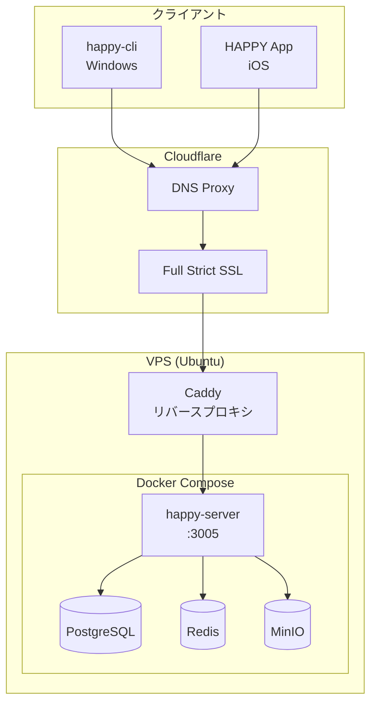

## 目次

- [HAPPYとは](#happyとは)
- [主な機能](#主な機能)
  - [セッション共有・リモート操作](#セッション共有リモート操作)
  - [モバイル認証（鍵ベース）](#モバイル認証鍵ベース)
  - [Codexモード（自律実行）](#codexモード自律実行)
  - [Push通知](#push通知)
  - [マルチデバイス管理](#マルチデバイス管理)
- [全体構成](#全体構成)
- [環境構築の実際のプロセス](#環境構築の実際のプロセス)
  - [1. happy-serverの起動](#1-happy-serverの起動)
  - [2. Prisma / DB周りの対応](#2-prisma--db周りの対応)
  - [3. ローカル疎通確認](#3-ローカル疎通確認)
  - [4. Caddyの設定](#4-caddyの設定)
  - [5. Cloudflare側の設定](#5-cloudflare側の設定)
  - [6. happy-cli側の設定](#6-happy-cli側の設定)
  - [7. 認証フロー](#7-認証フロー)
- [途中で遭遇した問題たち](#途中で遭遇した問題たち)
- [現在の状態](#現在の状態)
- [想定ユースケース](#想定ユースケース)
- [感想](#感想)

<br/>

## HAPPYとは

**HAPPY** は PC 上の Claude Code / Codex セッションを、スマートフォンから安全に操作・監視するためのツール群だ。

長時間のコード生成タスクを放置して実行したり、外出先から進捗を確認したり、危険な操作が実行される前にスマホで承認したりできる。

HAPPYは以下の3つのコンポーネントで構成されている。

| コンポーネント | 役割 |
|---------------|------|
| **happy-cli** | PC上でClaude Code / Codexを起動・制御するCLI |
| **HAPPYモバイルアプリ** | iOS/Androidで認証・操作・通知を行うクライアント |
| **happy-server** | 認証・セッション管理・通知・データ永続化を担当するバックエンド |

<br/>

## 主な機能

### セッション共有・リモート操作

PC上で動作するClaude Codeセッションをスマホから確認・操作できる。

QRコードまたは認証フローで安全に接続し、リアルタイムでセッションの状態を監視可能。

### モバイル認証（鍵ベース）

公開鍵を用いた認証リクエストで、スマホ側で承認するまでCLIは待機する。

危険な操作（ファイル削除やシステム変更など）が実行される前に、追加の承認を求めることもできる。

### Codexモード（自律実行）

長時間タスクや調査・リファクタリング向けの自動実行モード。

進捗や完了をモバイルへ通知してくれるので、PCの前に張り付いている必要がない。

### Push通知

処理完了・エラー・任意メッセージをスマホへ即座に送信。

バックグラウンドで実行しているタスクの状況をリアルタイムで把握できる。

### マルチデバイス管理

複数端末の接続・失効管理に対応。

セッション単位での細かい制御が可能。

<br/>

## 全体構成

今回構築したシステムの全体像は以下の通り。

**クライアント側**
- happy-cli（Windows / Node.js）
- iOS HAPPYモバイルアプリ

**サーバー側（VPS / Ubuntu 25.04）**
- Caddy（リバースプロキシ）
- Docker / docker compose
  - happy-server（Node.js）
  - PostgreSQL
  - Redis
  - MinIO

**DNS / TLS**
- Cloudflare（DNS + Full strict SSL）
- Cloudflare Origin Certificate



<br/>

## 環境構築の実際のプロセス

公式のHAPPYクラウドではなく、自分のVPS上でhappy-serverを動かすことが目標。以下、実際に行った作業を時系列で記録する。

### 1. happy-serverの起動

VPSにDocker / docker composeをインストールし、happy-serverリポジトリをclone。

docker composeを使用して以下のコンテナを起動した。

- happy-server
- postgres
- redis
- minio

```bash
# リポジトリをclone
git clone https://github.com/anthropics/happy-server.git
cd happy-server

# コンテナを起動
docker compose up -d
```

ここで早速トラブルが発生。

- **Docker daemonのpermission denied** → `sudo`を使用して解決
- **prisma schemaがコンテナに入っていない** → Dockerfileに`prisma`ディレクトリをCOPYする修正
- **DATABASE_URLが渡っていない** → docker-compose.ymlのenv設定を確認・修正
- **PostgreSQL認証エラー（P1000）** → postgres側とhappy-server側のパスワード整合性を確認

### 2. Prisma / DB周りの対応

初期状態ではテーブルが存在せず、Prismaエラーが多発した。

```bash
# コンテナ内でPrisma migrationを実行
docker compose exec happy-server npx prisma migrate deploy
```

PostgreSQL内に以下のテーブルが作成されたことを確認。

- Session
- Account
- User
- その他（計21テーブル）

エラーが一部出つつも、最終的にhappy-serverが正常起動。

### 3. ローカル疎通確認

VPS上で以下を実行して疎通確認。

```bash
curl http://127.0.0.1:3005/
```

```
Welcome to Happy Server!
```

happy-server自体は正常稼働している状態になった。

### 4. Caddyの設定

systemdでCaddyを常駐起動させた。

Cloudflare Origin Certificateを取得し、Caddyfileに以下の設定を記述。

```
api.haroin57.com {
    tls /path/to/origin.pem /path/to/origin-key.pem
    reverse_proxy 127.0.0.1:3005
}
```

これで `https://api.haroin57.com → localhost:3005` のルーティングが成立。

### 5. Cloudflare側の設定

Cloudflareのダッシュボードで以下を設定。

- `api.haroin57.com` のAレコードをVPSのIPに設定
- プロキシ（オレンジ雲）ON
- SSL/TLSモード：**Full (strict)**

確認作業：

```bash
# DNSの確認（CloudflareのIPが返る）
dig api.haroin57.com

# HTTPS経由でアクセス確認
curl -I https://api.haroin57.com/
```

レスポンスヘッダに `server: cloudflare` が出ていれば成功。

### 6. happy-cli側の設定

Windowsにてhappy-cliをnpmでグローバルインストール。

```bash
npm install -g happy-cli
```

環境変数で自前サーバーを指定。

```powershell
# PowerShellの場合
$env:HAPPY_SERVER_URL="https://api.haroin57.com"
```

```bash
# bash / zshの場合
export HAPPY_SERVER_URL=https://api.haroin57.com
```

### 7. 認証フロー

`happy auth`コマンドを実行。

認証方式として「Web Browser」または「Mobile App」を選択できる。

ブラウザが自動で以下のURLに遷移。

```
https://app.happy.engineering/terminal/connect#key=xxxx
```

iOS HAPPYアプリと連携し、サーバー側の `/v1/auth/request` が正常応答。

最終的に接続が確立された。

<br/>

## 途中で遭遇した問題たち

実際の構築では様々な問題に遭遇した。同じことをやろうとしている人の参考になれば。

### DNSが想定IPに向かない

**原因**: Cloudflareプロキシ経由なので、AレコードはCloudflareのIPになる（これは正常）。

**切り分け方法**: `curl --resolve` を使って直接VPSを指すことで、Caddy側の問題かCloudflare側の問題か切り分けられる。

```bash
curl --resolve api.haroin57.com:443:xxx.xxx.xxx.xxx https://api.haroin57.com/
```

### Origin Certificate未設定時のTLSエラー

Cloudflare Full (strict) モードでは、オリジンサーバー側にも有効な証明書が必要。Cloudflare Origin Certificateを発行してCaddyに設定することで解決。

### prisma schemaがDocker build contextに含まれていない

Dockerfileの `COPY` 指示に `prisma/` ディレクトリが含まれていなかった。修正して再ビルド。

### docker composeをPowerShellで実行して混乱

WindowsのPowerShellからSSH越しにVPSを操作していたが、ローカルで `docker compose` を実行してしまい「no configuration file provided」になる場面があった。どこで何を実行しているか意識することが大事。

<br/>

## 現在の状態

- **happy-server**: 自前VPS上で3005番ポートで安定稼働
- **HTTPS + 独自ドメイン**: `https://api.haroin57.com` で外部公開済み
- **接続**: happy-cli ↔ HAPPYモバイルアプリ ↔ happy-server の三者間で疎通成功
- **動作確認**: Claude Codeセッションをモバイルからリモートでモニタリング可能

<br/>

## 想定ユースケース

HAPPYを使うと、以下のようなワークフローが可能になる。

1. **長時間のコード生成・修正を放置実行**
   - 大規模なリファクタリングや、時間のかかるテスト実行を夜間に回す
   - 完了したらスマホに通知が届く

2. **外出先からの進捗確認・追加指示**
   - 電車の中やカフェからでもセッションの状態をチェック
   - 必要に応じて追加の指示を送れる

3. **危険操作のリモート承認**
   - ファイル削除やデータベース操作など、慎重さが求められる処理の前に承認要求
   - 意図しない操作を未然に防げる

4. **通知ベースの非同期開発フロー**
   - PCに張り付かずとも開発を進められる
   - 通知で必要なタイミングにだけ対応

<br/>

## 感想

正直、思っていたより大変だった。

「docker compose upして環境変数設定すれば動くだろう」くらいに考えていたが、実際にはDockerfile内のCOPY漏れ、Prismaのマイグレーション、PostgreSQLの認証設定、Cloudflareの証明書周りなど、細かいところで躓くポイントが多かった。

特にCloudflare + Caddy + Dockerの組み合わせは、どこで問題が起きているのか切り分けるのが難しい。`curl --resolve` でDNSをバイパスしたり、各レイヤーで個別に疎通確認したりする地道な作業が必要だった。

ただ、一度動いてしまえば快適だ。外出先からスマホでClaude Codeのセッションを確認できるのは、長時間タスクを走らせるときに安心感がある。「ちゃんと動いてるかな」とPCの前に戻る必要がなくなった。

今後は以下のことを試してみたい。

- Cloudflare Tunnelへの切り替え（VPSのIPを非公開にできる）
- happy-cliの各コマンドの実用的な使い方を深掘り
- この構成を再現できる完全手順書の整備

自前サーバーでHAPPYを動かしたい人の参考になれば幸いです。
