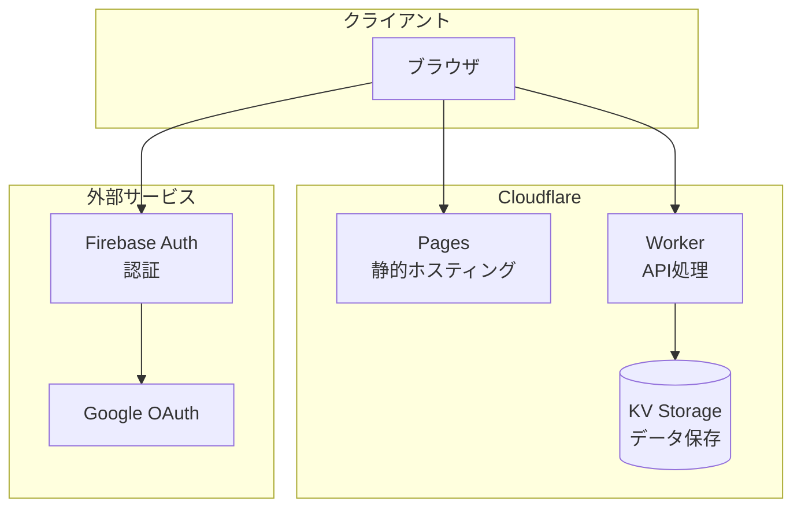
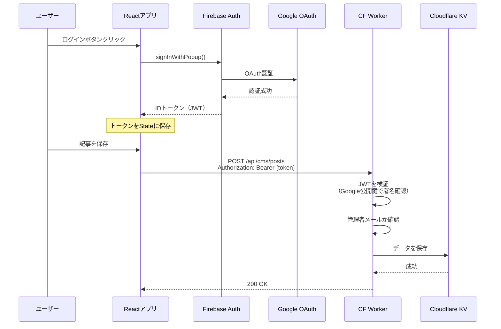
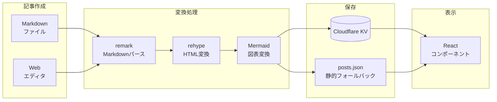
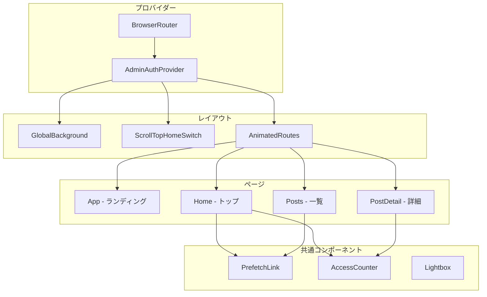
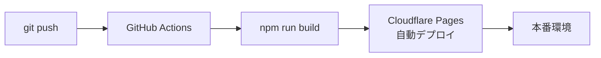

haroin57.comの技術構成を、図解を交えて解説する。

## 目次

- [アーキテクチャ概要](#アーキテクチャ概要)
- [技術スタック](#技術スタック)
- [プロジェクト構成](#プロジェクト構成)
- [認証フロー](#認証フロー)
- [データフロー](#データフロー)
- [コンポーネント設計](#コンポーネント設計)
- [セキュリティ実装](#セキュリティ実装)
- [デプロイ方法](#デプロイ方法)

<br/>

## アーキテクチャ概要

haroin57.comは、フロントエンドとバックエンドを分離したモダンなJamstackアーキテクチャを採用している。



**ポイント:**

- **静的サイト生成**: ViteでビルドしたReactアプリをCloudflare Pagesでホスティング
- **エッジAPI**: Cloudflare WorkerでAPIを処理（低レイテンシ）
- **認証分離**: Firebase Authで認証、WorkerでJWT検証

<br/>

## 技術スタック

| レイヤー | 技術 | 役割 |
|---------|------|------|
| **フロントエンド** | React + TypeScript | UIコンポーネント |
| **スタイリング** | Tailwind CSS | ユーティリティファーストCSS |
| **ビルド** | Vite | 高速ビルド・HMR |
| **ルーティング** | React Router | SPA ルーティング |
| **ホスティング** | Cloudflare Pages | 静的サイト配信 |
| **API** | Cloudflare Worker | エッジでのAPI処理 |
| **データベース** | Cloudflare KV | Key-Valueストア |
| **認証** | Firebase Auth | Google OAuth |
| **Markdown** | unified + remark + rehype | 記事変換 |
| **図表** | Mermaid | ダイアグラム描画 |

<br/>

## プロジェクト構成

```
src/
├── main.tsx                 # エントリーポイント
├── App.tsx                  # ランディングページ
├── contexts/
│   └── AdminAuthContext.tsx # 認証コンテキスト
├── components/
│   ├── AnimatedRoutes.tsx   # ルーティング
│   ├── GlobalBackground.tsx # 背景管理
│   ├── AccessCounter.tsx    # PVカウンター
│   └── admin/
│       └── MarkdownEditor.tsx
├── routes/
│   ├── Home.tsx             # ホームページ
│   ├── Posts.tsx            # 記事一覧
│   ├── PostDetail.tsx       # 記事詳細
│   └── admin/
│       └── PostEditor.tsx   # 記事編集
└── lib/
    ├── firebase.ts          # Firebase初期化
    └── draftStorage.ts      # 下書き保存
```

<br/>

## 認証フロー

Firebase AuthとCloudflare Workerを組み合わせた認証フローを採用。



**JWT検証のポイント:**

1. トークンをBase64デコード
2. `alg: RS256` を確認（ダウングレード攻撃防止）
3. `exp`（有効期限）をチェック
4. `iss`（発行者）がFirebaseか確認
5. Google公開鍵で署名を検証
6. メールアドレスが管理者リストに含まれるか確認

<br/>

## データフロー

記事の作成から表示までのデータフロー。



<br/>

## コンポーネント設計

主要コンポーネントの関係性。



**コンポーネントの役割:**

| コンポーネント | 役割 |
|--------------|------|
| `AdminAuthProvider` | 認証状態を管理・提供 |
| `GlobalBackground` | 背景画像のレスポンシブ管理 |
| `AnimatedRoutes` | ページ遷移アニメーション |
| `PrefetchLink` | ホバー時にルートをプリフェッチ |
| `AccessCounter` | PVカウンターAPI呼び出し |

<br/>

## セキュリティ実装

### JWT検証フロー

```mermaid
flowchart TB
    Start[リクエスト受信] --> Extract[Authorization<br/>ヘッダー抽出]
    Extract --> Split[JWTを3部分に分割<br/>Header.Payload.Signature]

    Split --> CheckAlg{alg = RS256?}
    CheckAlg -->|No| Reject1[拒否: 不正なアルゴリズム]
    CheckAlg -->|Yes| CheckExp{exp > 現在時刻?}

    CheckExp -->|No| Reject2[拒否: トークン期限切れ]
    CheckExp -->|Yes| CheckIss{iss = Firebase?}

    CheckIss -->|No| Reject3[拒否: 不正な発行者]
    CheckIss -->|Yes| GetKey[Google公開鍵を取得]

    GetKey --> Verify{署名が有効?}
    Verify -->|No| Reject4[拒否: 署名不正]
    Verify -->|Yes| CheckEmail{管理者メール?}

    CheckEmail -->|No| Reject5[拒否: 権限なし]
    CheckEmail -->|Yes| Allow[許可: APIを実行]

    style Allow fill:#134e4a,stroke:#5eead4
    style Reject1 fill:#7f1d1d,stroke:#fca5a5
    style Reject2 fill:#7f1d1d,stroke:#fca5a5
    style Reject3 fill:#7f1d1d,stroke:#fca5a5
    style Reject4 fill:#7f1d1d,stroke:#fca5a5
    style Reject5 fill:#7f1d1d,stroke:#fca5a5
```



### 実装されている対策

| 対策 | 目的 |
|------|------|
| RS256署名検証 | トークン偽造防止 |
| アルゴリズム固定 | ダウングレード攻撃防止 |
| 有効期限チェック | セッションハイジャック防止 |
| 発行者検証 | 不正トークン排除 |
| 公開鍵キャッシュ | パフォーマンス最適化 |
| 管理者メールリスト | 認可制御 |

<br/>

## デプロイ方法

### ローカル記事のデプロイ

```bash
# 環境変数を設定
export FIREBASE_ID_TOKEN="取得したトークン"
export ADMIN_SECRET="シークレット"

# すべての記事をデプロイ
npx tsx scripts/deploy-posts.ts

# 特定のファイルのみ
npx tsx scripts/deploy-posts.ts --file content/posts/my-article.md

# 下書きとして
npx tsx scripts/deploy-posts.ts --draft

# ドライラン（確認のみ）
npx tsx scripts/deploy-posts.ts --dry-run
```

### 記事ファイルの形式

```yaml
---
title: "記事タイトル"
summary: "記事の概要"
date: "2025-01-15"
tags:
  - React
  - TypeScript
---

本文をMarkdownで記述...
```

### CI/CDパイプライン



<br/>

---

このドキュメントは haroin57-web プロジェクトの技術的な全体像を示している。詳細な実装については、各ソースファイルのコメントを参照。
