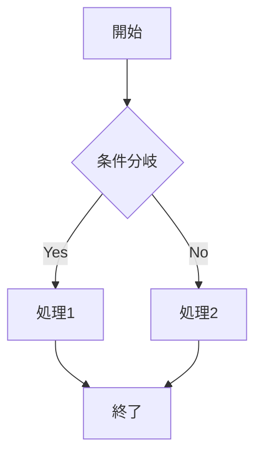
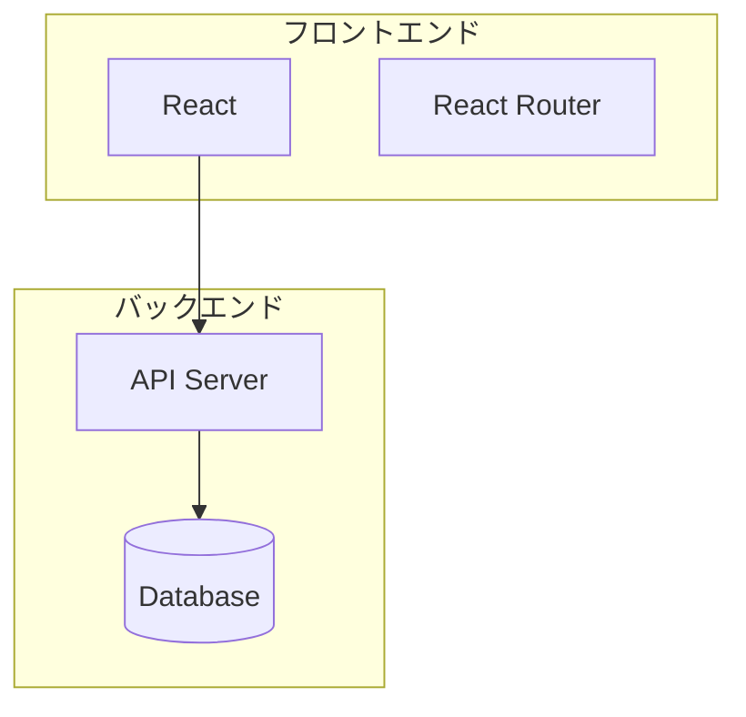
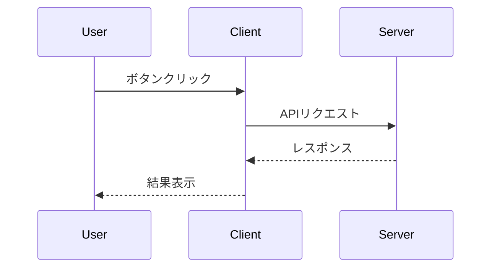
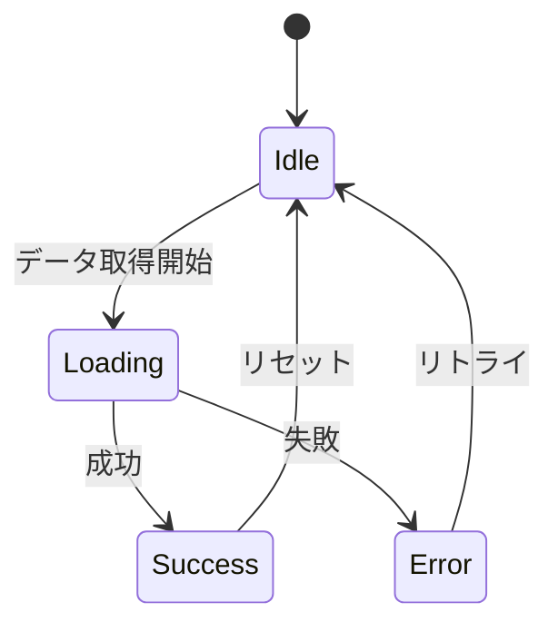
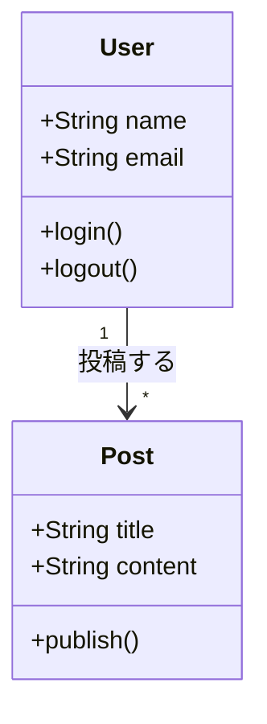
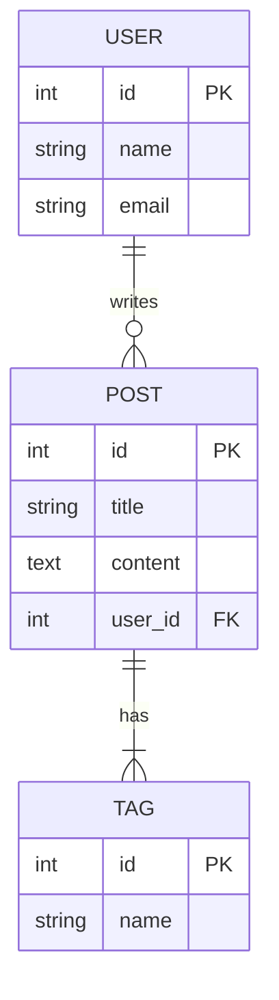
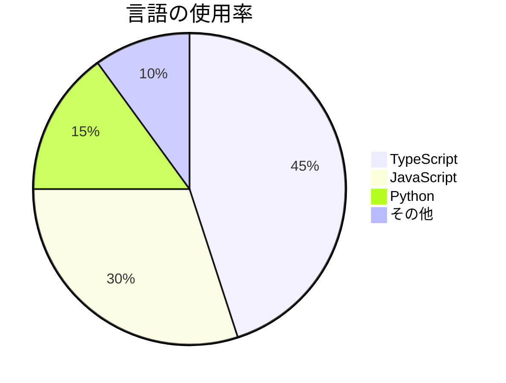

```mermaid
flowchart LR
    A[通常] --> B[強調]
    B --> C[薄い]

    style B fill:#134e4a,stroke:#5eead4,stroke-width:2px
    style C opacity:0.5
```

このサイトのPostsは `content/posts/*.md` をHTMLへ変換して表示しています。
ここでは「このサイトで使えるMarkdown記法」を備忘録としてまとめます。

## 目次

<br/>

## ベースライン（GFM）

基本は GitHub Flavored Markdown（GFM）です。

### 見出し

`#`〜`####` で見出しを記述します。

````md
# 見出し1
## 見出し2
### 見出し3
#### 見出し4
````

表示例:

#### 見出し例

<br/>

### 箇条書き

`-` または `*` で箇条書きリストを記述します。

````md
- 項目1
- 項目2
  - ネストした項目
- 項目3
````

表示例:

- 項目1
- 項目2
  - ネストした項目
- 項目3

<br/>

### 番号付きリスト

`1.` で番号付きリストを記述します。

````md
1. 最初の項目
2. 2番目の項目
3. 3番目の項目
````

表示例:

1. 最初の項目
2. 2番目の項目
3. 3番目の項目

<br/>

### 強調

`*italic*` でイタリック、`**bold**` で太字になります。

````md
これは *イタリック* で、これは **太字** です。
````

表示例:

これは *イタリック* で、これは **太字** です。

<br/>

### 打ち消し線

`~~text~~` で打ち消し線を引けます。

````md
~~打ち消し線のテキスト~~
````

表示例:

~~打ち消し線のテキスト~~

<br/>

### インラインコード

`` `code` `` でインラインコードを記述します。

````md
このコマンドは `npm install` で実行します。
````

表示例:

このコマンドは `npm install` で実行します。

<br/>

### 表（テーブル）

`|` 区切りでテーブルを記述します。

````md
| 列1 | 列2 | 列3 |
|------|------|------|
| データ1 | データ2 | データ3 |
| データ4 | データ5 | データ6 |
````

表示例:

| 列1 | 列2 | 列3 |
|------|------|------|
| データ1 | データ2 | データ3 |
| データ4 | データ5 | データ6 |

<br/>

### リンク

`[text](url)` でリンクを記述します。

````md
[Google](https://google.com)
````

表示例:

[Google](https://google.com)

<br/>

## コードブロック（MDN寄せ）

MDN の「Markdown の書き方」に寄せて、コードフェンス（```）の情報文字列を次のように扱います。

<br/>

### 言語指定

先頭の単語を言語として扱います。

````md
```js
console.log("hello");
```
````

表示例:

```js
console.log("hello");
```

注意事項:

- `plain` は `plaintext` と同じ扱いです。
- 以前使っていた ` ```lang:タイトル` の `:タイトル` 部分は無視されます（タイトル表示は行いません）。タイトルは本文として書いてください。

<br/>

### `-nolint`（リンター抑制）

言語名に `-nolint` を付けられます（例: `html-nolint`）。

````md
```html-nolint
<p>
I will not be linted.
</p>
```
````

表示例:

```html-nolint
<p>
I will not be linted.
</p>
``` 

<br/>

### 追加クラス（`example-good` / `example-bad`）

言語名の後ろに追加の単語を並べると、クラスとして扱います（MDNの「情報文字列」の考え方）。

````md
```js example-good
const ok = true;
```

```js example-bad
const nope = true;
```
````

実際の表示例（このページ上で見えるはず）:

```js example-good
const ok = true
```

```js example-bad
const nope = true
```

<br/>

### `hidden`（非表示）

`hidden` を付けたコードブロックは、HTMLに出力されません（表示されません）。

````md
```js hidden
const secret = "not shown";
```
````

<br/>

## メモ/警告/コールアウト（MDNアラート）

ブロック引用の先頭行を `[!NOTE]` / `[!WARNING]` / `[!CALLOUT]` にすると、専用のボックスとして描画されます。

````md
> [!NOTE]
> これはメモです。

> [!WARNING] 注意
> これは警告です。

> [!CALLOUT] タイトル
> これはコールアウトです。
````

実際の表示例:

> [!NOTE]
> これはメモです。

> [!WARNING] 注意
> これは警告です。

> [!CALLOUT] タイトル
> これはコールアウトです。

<br/>

## 定義リスト（MDN形式）

GFM のリスト構文を変形した、MDN 独自の定義リスト形式に対応しています。

````md
- 用語1
  - : 用語1の説明

- `用語2`
  - : **強調**も使えます
````

実際の表示例:

- 用語1
  - : 用語1の説明

- `用語2`
  - : **強調**も使えます

制約:

- 1つの用語（`dt`）につき、定義（`dd`）は1つだけ対応しています（複数 `dd` は変換しません）。

<br/>

## 数式（KaTeX）

- インライン数式: `$...$`（例: `$a^2 + b^2 = c^2$`）
- ブロック数式: `$$...$$`

例:

インライン: $a^2 + b^2 = c^2$

$$
\sum_{i=1}^{n} i = \frac{n(n+1)}{2}
$$

<br/>

## HTML をそのまま使う

Markdown内に書いた HTML はそのまま通ります（例: `<br />`, `<div>...</div>` など）。

<br/>

## 改行について

段落内の改行は基本的に `<br>` にはなりません（MDN/GFM寄せ）。

- 改行したい: 空行で段落を分ける、または `<br />` を明示します。

<br/>

## Mermaid ダイアグラム

コードブロックの言語を `mermaid` に指定すると、ダイアグラムとして描画されます。

<br/>

### フローチャート (flowchart)

システムの流れや構成を表現するのに便利です。

````md

````

表示例:


フローチャートの方向:
- `TB` (Top to Bottom): 上から下
- `LR` (Left to Right): 左から右
- `BT` (Bottom to Top): 下から上
- `RL` (Right to Left): 右から左

ノードの形状:
- `[text]`: 四角形
- `(text)`: 角丸四角形
- `{text}`: ひし形（条件分岐）
- `((text))`: 円形
- `[[text]]`: サブルーチン

<br/>

### サブグラフ (subgraph)

関連する要素をグループ化できます。

````md

````

表示例:


<br/>

### シーケンス図 (sequenceDiagram)

処理の流れや通信を時系列で表現できます。

````md

````

表示例:


矢印の種類:
- `->>`: 実線矢印（同期メッセージ）
- `-->>`: 点線矢印（応答）
- `-x`: 非同期メッセージ
- `--x`: 非同期応答

<br/>

### 状態遷移図 (stateDiagram-v2)

状態の変化を表現できます。

````md

````

表示例:


- `[*]`: 開始/終了状態
- `-->`: 遷移
- `: ラベル`: 遷移条件/イベント

<br/>

### クラス図 (classDiagram)

オブジェクト指向設計を表現できます。

````md

````

表示例:


<br/>

### ER図 (erDiagram)

データベース設計を表現できます。

````md

````

表示例:


関係の記法:
- `||--||`: 1対1
- `||--o{`: 1対多（0以上）
- `||--|{`: 1対多（1以上）
- `}o--o{`: 多対多

<br/>

### 円グラフ (pie)

割合を可視化できます。

````md

````

表示例:


<br/>

### スタイルのカスタマイズ

ノードにスタイルを適用できます。

````md

````

表示例:


<br/>

