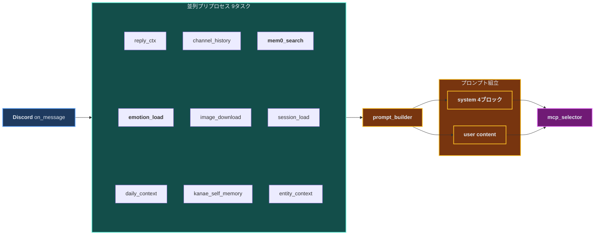
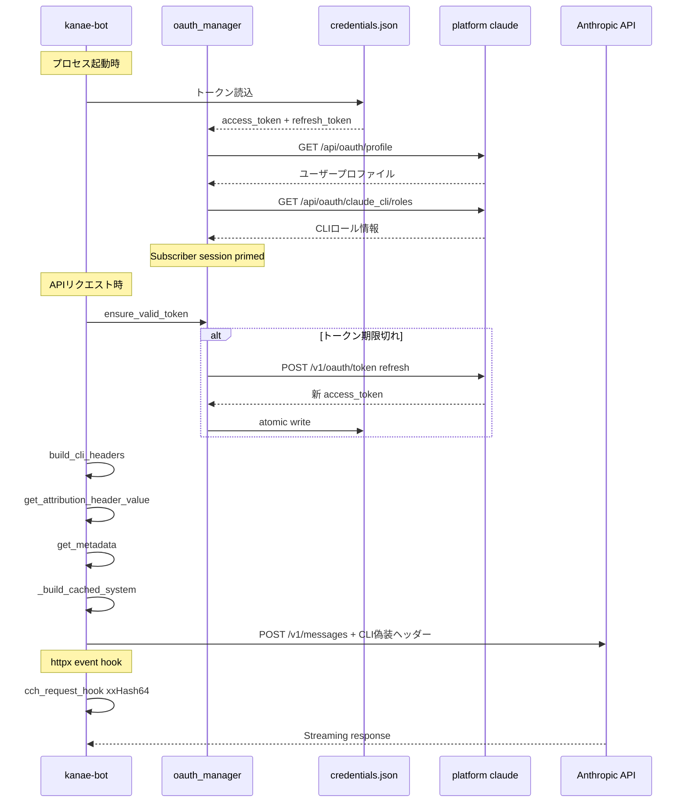
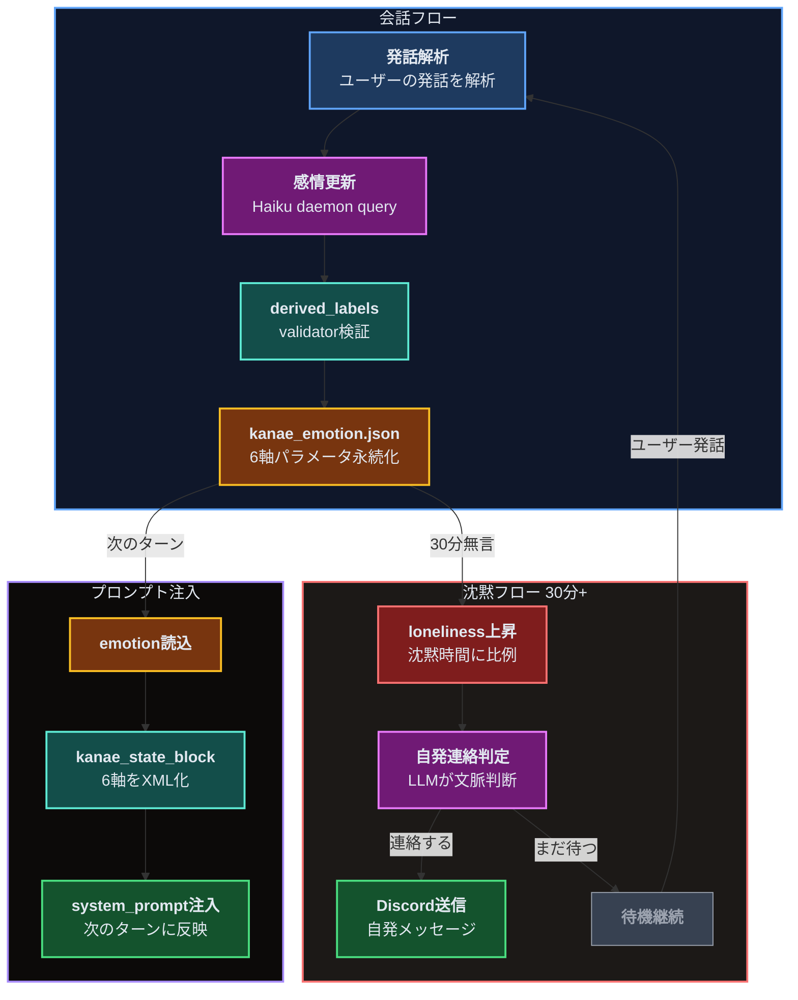

## 概要

kanae-botは、Anthropic Claude Code CLIのプロトコルを**リバースエンジニアリング**して構築したDiscord AIコンパニオンです。

やってることは大きく3つ:

1. **Claude Code CLIのAPI通信プロトコルを解析・再現** — mitmproxyで通信を傍受し、リクエストボディ・ヘッダー・認証フローを完全に模倣してSubscriber tierのAPIを叩く
2. **Mem0（長期記憶）を複数の論文を参考に独自最適化** — Zep, Cognee, ACT-Rの知見を統合した5フェーズの大規模改修
3. **6軸感情エンジン** — LLM常駐デーモンが会話・沈黙・時間経過に応じて感情パラメータを動的に遷移させる

コード規模は主要ファイルだけで**10,728行**。VPS (ConoHa) 上でsystemdサービスとして24時間稼働しています。

<br/>

## Claude Code CLI リバースエンジニアリング

### 背景

Claude Code CLIはNode.js (Bun) で実装されたCLIツールで、Anthropic Messages APIに対して独自の認証・識別プロトコルを使っています。通常のAPI keyとは異なるOAuth Subscriberフローで認証し、Subscriber tier専用のレートリミットバケットでリクエストを処理します。

このプロトコルは公式にはドキュメント化されていません。kanae-botは、CLIの通信をmitmproxyで傍受・解析し、Pythonで完全に再現することでSubscriber tierのAPIアクセスを実現しています。

<br/>

### mitmproxyによる通信解析

CLIの通信を傍受するために、mitmproxyをHTTPSプロキシとして挟みました。

**解析で判明した主要な識別要素:**

| 要素 | 内容 | 目的 |
|------|------|------|
| **User-Agent** | `claude-cli/{version} (external, sdk-cli)` | CLI識別 |
| **X-Stainless-*** | Lang=js, Runtime=node, OS=Linux, Arch=x64 | SDKプラットフォーム識別 |
| **X-Claude-Code-Session-Id** | UUIDv4 | セッション追跡 |
| **x-app** | `cli` | アプリケーション識別 |
| **metadata.user_id** | `{"device_id":"...","account_uuid":"...","session_id":"..."}` | Subscriberアカウント識別 |
| **system[0]** | `x-anthropic-billing-header: cc_version=...;cc_entrypoint=...;cch=...;` | 課金・認証ヘッダー |
| **system[2]** | CLIのデフォルトシステムプロンプト（11,700文字） | Subscriber tier識別 |
| **Betas** | `claude-code-20250219`, `oauth-2025-04-20`, `interleaved-thinking-2025-05-14` 等 | 機能フラグ |

<br/>

### ヘッダー偽装の実装

```python
# client_factory.py — CLIと同一のヘッダーセットを構築
def build_cli_headers() -> dict[str, str]:
    return {
        "x-app": "cli",
        "User-Agent": f"claude-cli/{CC_VERSION} (external, sdk-cli)",
        "X-Claude-Code-Session-Id": _session_id,
        "X-Stainless-Lang": "js",
        "X-Stainless-Package-Version": "0.80.0",
        "X-Stainless-Runtime": "node",
        "X-Stainless-Runtime-Version": "v24.14.1",
        "X-Stainless-OS": "Linux",
        "X-Stainless-Arch": "x64",
        "X-Stainless-Timeout": "600",
        "x-client-request-id": str(uuid.uuid4()),
    }
```

Python SDKのデフォルトヘッダーを送信すると、Anthropicサーバー側でSubscriber tierバケットから除外され、HTTP 429が頻発します。Node.js CLIと同一のヘッダーセットを送ることで、Subscriber tierのレートリミットが適用されます。

<br/>

### CCH Attestation（リクエストボディ署名）

CLIは各リクエストに対してxxHash64ベースの署名（CCH: Client Content Hash）を付与します。これはBun/Zigのネイティブレイヤーで実装されており、通常のNode.jsからはアクセスできません。

**アルゴリズム（コンパイル済みBunバイナリから抽出）:**

```python
# attestation.py
CCH_SEED: int = 0x6E52736AC806831E  # Bunバイナリから抽出したシード値

def patch_cch_body(body: bytes) -> bytes:
    """リクエストボディのcch=00000プレースホルダーを実際のハッシュで置換"""
    digest = xxhash.xxh64(body, seed=CCH_SEED).intdigest()
    token = format(digest & 0xFFFFF, "05x")  # 下位20ビットを5桁hex化
    return body.replace(b"cch=00000", f"cch={token}".encode(), 1)
```

**処理フロー:**

1. システムプロンプトに `cch=00000` プレースホルダーを埋め込む
2. SDK がリクエストボディ全体をJSON シリアライズ
3. httpx event hookでボディバイト列をxxHash64で署名
4. プレースホルダーを実際のハッシュ値で置換してから送信

シード値 `0x6E52736AC806831E` はClaude Code 2.1.37から2.1.92+まで一貫して同一であることを確認済みです。

<br/>

### Billing Header（課金認証ヘッダー）

CLIは `system[0]` にbilling headerを埋め込みます。このヘッダーにはCLIバージョンに基づくSHA256サフィックスが含まれます。

```python
# client.py
_BILLING_SALT = "59cf53e54c78"  # CLI cli.jsから抽出

def get_attribution_header_value(messages):
    # 最初のユーザーメッセージから特定位置の文字を抽出
    text = _first_user_text(messages)
    picks = text[4] + text[7] + text[20]  # 4,7,20番目の文字
    
    # SALT + picks + VERSION のSHA256ハッシュ先頭3文字
    raw = f"{_BILLING_SALT}{picks}{CC_VERSION}"
    suffix = hashlib.sha256(raw.encode()).hexdigest()[:3]
    
    return (
        f"x-anthropic-billing-header: "
        f"cc_version={CC_VERSION}.{suffix}; "
        f"cc_entrypoint=sdk-cli; "
        f"cch={_generate_cch()};"
    )
```

**なぜこれが必要か:**

APIサーバーはこのヘッダーをSubscriber tier識別に使用しています。ヘッダーが欠落または不正な場合、リクエストはGeneric OAuthバケットに分類され、大幅に厳しいレートリミットが適用されます。

<br/>

### OAuth認証フロー

Claude Code CLIは `~/.claude/.credentials.json` にOAuthトークンを保存します。kanae-botはこのトークンファイルを読み取り、自動リフレッシュを行います。

```python
# oauth_manager.py
TOKEN_URL = "https://platform.claude.com/v1/oauth/token"
CLIENT_ID = "9d1c250a-e61b-44d9-88ed-5944d1962f5e"
REFRESH_SCOPES = [
    "user:profile",
    "user:inference", 
    "user:sessions:claude_code",
    "user:mcp_servers",
    "user:file_upload",
]
```

**追加の認証ステップ:**

Subscriber tierとして認識されるためには、OAuthトークンだけでは不十分です。CLIが起動時に行う以下のリクエストを再現する必要があります:

1. `GET /api/oauth/profile` — ユーザープロファイル取得
2. `GET /api/oauth/claude_cli/roles` — CLIロール確認

`prime_subscriber_session()` がこれらを一度だけ実行し、サーバー側のセッション状態を初期化します。

<br/>

### System Prompt構造

mitmproxyで捕捉したCLI 2.1.92のsystemブロック構造:

```
system[0] = billing header (キャッシュなし)
            "x-anthropic-billing-header: cc_version=2.1.92.abc; ..."

system[1] = CLI identity text (キャッシュなし)
            "You are Claude Code, Anthropic's official CLI for Claude."

system[2] = CLIデフォルトシステムプロンプト (11,700文字)
            cache_control={"type":"ephemeral","scope":"global"}
            ※Subscriber tier識別に使用されていると推定

system[3] = カスタムプロンプト (CLAUDE.md等)
            ※後から来るシステムテキストが優先される
```

kanae-botはこの4ブロック構造を完全に再現し、`system[3]` にかなえの人格プロンプトを注入しています。

<br/>

### CLIバージョン自動追従

```bash
# scripts/refresh_cli_identity.sh (daily cron)
# CLI更新時にバージョン番号・ベータフラグを自動取得して
# client.py の AUTO-CAPTURE-START〜END ブロックを更新
```

CLIのアップデートに追従して、`CC_VERSION`, `MODEL_BETAS`, `CLI_IDENTITY_TEXT` を自動更新します。バージョン不一致でSubscriber tier識別が失敗するリスクを排除しています。

<br/>

### リクエストボディの偽装

CLIが送信するbody fieldsを完全に再現:

```python
# client.py
THINKING_CONFIG = {"type": "adaptive"}    # 適応的思考 (固定cap無し)
OUTPUT_CONFIG = {"effort": "max"}          # 最大effort (low < medium < high < xhigh < max)
CONTEXT_MANAGEMENT_CONFIG = {
    "edits": [
        {"type": "clear_thinking_20251015", "keep": "all"},
    ],
}
```

`metadata.user_id` のJSONキー順序もJS の `JSON.stringify` の出力と一致させています:

```python
def get_metadata():
    payload = {
        "device_id": account.get("device_id", ""),    # 順序が重要
        "account_uuid": account.get("account_uuid", ""),
        "session_id": _session_id,
    }
    return {"user_id": json.dumps(payload, separators=(",", ":"))}
```

サーバーはこのJSON文字列をバイト単位で比較していると推定されるため、`separators=(",", ":")` でスペースを除去し、キー挿入順序を固定しています。

<br/>

## Mem0 長期記憶の独自最適化

### 動機

Mem0はデフォルトで英語ラベルの事実抽出（"Prefers ~", "Likes ~"）を行いますが、日本語会話では精度が低く、他者の発言が混入し、重複が蓄積するという問題がありました。

これを解決するために、複数の論文・プロダクトの知見を参考に5フェーズの大規模改修を実施しました。

<br/>

### 参照した論文・プロダクト

| 文献 | 知見 | 適用箇所 |
|------|------|----------|
| **Zep** (arXiv:2501.13956v1) | Episode-mentions reranker + Temporal KG | mention頻度boost, entity graph |
| **Cognee** (cognee.ai) | Weighted graph nodes/edges | mention_count, reinforcement |
| **ACT-R** (Anderson & Lebiere) | Base-level activation: recency + frequency | reinforcement_boost計算式 |
| **Lost-in-the-Middle** (Liu et al. 2023, TACL 2024) | 100K+ contextでのU字型attention劣化 | hybrid search + working memory |
| **HyDE** (Hypothetical Dense Retrieval) | Query拡張 | 実装予定 (フラグ化済み) |

<br/>

### Phase 1: System Message汚染の止血

**問題:** `bot.py` がDiscordチャンネル履歴全体をsystem messageに流し込んでおり、他者の発言が「先輩の事実」としてMem0に混入していた（868件中複数人分）。

**修正:** channel historyの直接注入を廃止。`[user, assistant]` ペアのみを処理対象に限定。

<br/>

### Phase 2: Ingest Gate + 2段階Dedup

Haiku 4.5による日本語特化のfact抽出ゲートを実装。

**抽出フロー:**
```
<user_text> + <assistant_text> + <context_hint> + <known_entities>
    ↓ Haiku 4.5
{
  "facts": [{"speaker", "text", "importance", "category", "tags"}],
  "entities": [{"name", "type", "aliases"}]
}
    ↓ フィルタ
speaker=='self' AND importance >= MIN のみ保存
```

**2段階Dedup:**

| cosine distance | 判定 |
|----------------|------|
| ≤ 0.15 | 硬drop（確定重複） |
| 0.15 〜 0.35 | Haiku LLM判定（「同一事実か？」） |
| > 0.35 | 確実に別（保持） |

LLM判定により「Rust好き」と「Rust使ってる」のようなaspect違いを区別できます。

**結果:** 1,382件 → 1,126件（-26%）、ノイズ除去。

<br/>

### Phase 3: Smart Search（Rewrite + Rerank）

**処理フロー:**
```
raw_query
  ↓ Haiku query rewrite (正準キーワード変換)
  ↓ 表記揺れ吸収 (「前に話した」→ 複数keywords展開)
  ↓
  ├─ Vector search (ChromaDB, text-embedding-3-small)
  └─ BM25 search (SQLite FTS5, 日本語形態素解析)
  ↓
  RRF (Reciprocal Rank Fusion, k=60) で統合
  ↓
  Entity 1-hop expansion (graph layer)
  ↓
  Haiku LLM rerank + reinforcement_boost
  ↓
  top-k results
```

**RRF (Reciprocal Rank Fusion):**
```
score = 1/(k + vector_rank) + 1/(k + bm25_rank)
```

BM25は日本語の形態素分かち書きに対応しており、固有名詞のピンポイント検索でVector searchを補完します。

<br/>

### Phase 4: Obsidian-style Knowledge Graph

SQLiteベースのナレッジグラフを構築。

```sql
entities (844件)
  ├─ canonical_name, type (person/project/tech/media/place/concept)
  └─ mention_count

entity_aliases
  └─ 「ぼたん」→「上伊那ぼたん」のような表記揺れを解決

fact_entity_edges (1,322件)
  └─ fact_id ↔ entity_id (subject/object/topic)

entity_relations (時系列状態変化)
  └─ src → rel_type → dst (valid_from, valid_to)
  └─ 例: 先輩 → 髪色 → 黒 (valid_to=変更日)
         先輩 → 髪色 → ハイトーン (valid_from=変更日)
```

検索時にtop-3候補からentityを抽出し、1-hop expansion で関連factを引き込みます。

**実際のナレッジグラフ（mention_count ≥ 20のエンティティ、33ノード / 73エッジ）:**


<br/>

### Phase 5: Hebbian Reinforcement

ACT-Rのbase-level activationに着想を得た強化学習的メモリ管理。

```python
def reinforcement_boost(metadata):
    mention = metadata.get('mention_count', 1)
    last_r = metadata.get('last_reinforced_at')
    
    # frequency: log減衰 (1→10 = 10→100 と同じdelta)
    boost_freq = 0.10 * log(1 + mention)
    
    # recency: 30日 half-life
    days_since = (now - last_r) / 86400
    boost_recency = 0.05 * exp(-days_since / 30)
    
    # age: 新しい事実を優先
    boost_age = 0.03 * exp(-days_since_creation / 90)
    
    return boost_freq + boost_recency + boost_age
```

重複検出時に事実を削除するのではなく `mention_count` をインクリメントし、情報損失を防ぎながら頻出事実を強化します。

<br/>

### Taxonomy（分類体系）

8カテゴリ × 38サブカテゴリの分類体系を全1,126件に適用:

| カテゴリ | 件数 | 例 |
|---------|------|-----|
| hobby | 156 | 音楽制作、バイク、映画 |
| project | 139 | discord-bot、haroin57.com |
| science | 138 | 量子ML、分散システム |
| tech | 117 | Rust、TypeScript、Docker |
| meta | 116 | 会話スタイル、設定 |
| personal | 96 | 名前、住所、関係性 |
| ops | 74 | VPS、デプロイ、監視 |
| invest | 24 | 暗号資産、VC |

**tier:**
- Tier 0 (Live): 108件 — 常にアクティブ
- Tier 1 (Hot): 547件 — 頻繁に参照
- Tier 2 (Warm): 179件 — 時々参照
- Tier 3 (Cold): 26件 — アーカイブ候補

<br/>

### 週次品質監視

```bash
# cron: 毎週日曜 9:00 JST
0 9 * * 0 python scripts/weekly_mem0_compact.py
```

チェック項目:
1. **untagged_new**: 直近7日でtaxonomy未付与の新規fact
2. **dedup_group growth**: 重複クラスタサイズの異常増加
3. **archive候補**: tier-3 + importance≤2 + 60日以上前
4. **他者混入検知**: パターンマッチで別ユーザーの事実を検出（≥2件でアラート）
5. **intra-week near-dup**: SequenceMatcher ratio≥0.85

<br/>

## 6軸感情エンジン

### パラメータ

| 軸 | 説明 | 範囲 |
|----|------|------|
| **valence** | 感情の正負（快-不快） | -1.0 〜 1.0 |
| **arousal** | 覚醒度（興奮-鎮静） | 0.0 〜 1.0 |
| **loneliness** | 寂しさ（沈黙時間で上昇） | 0.0 〜 1.0 |
| **affection** | 好意・愛着 | 0.0 〜 1.0 |
| **anxiety** | 不安 | 0.0 〜 1.0 |
| **curiosity** | 好奇心 | 0.0 〜 1.0 |

### LLM常駐デーモン

v3ではコード内での代数的ルール（if文による時間判定など）を**全廃**し、Claude Haiku常駐デーモンが感情遷移を担当します。

**遷移トリガー:**
- **会話時**: ユーザーの発話内容・トーンから感情を更新
- **沈黙30分**: loneliness上昇、自発連絡の判定
- **時刻変化**: 朝・昼・夜の挨拶タイミングもLLMが判断

感情パラメータは `kanae_emotion.json` に永続化され、次のターンの `<kanae_state>` ブロックとしてプロンプトに注入されます。

<br/>

## 実運用ユースケース

### 1. 日常の会話パートナー

DiscordのDMチャンネルで24時間いつでも会話できます。Mem0による長期記憶があるため、数ヶ月前の話題を自然に参照できます。

- 「この前話してたRustの非同期ランタイムの件、調べた？」→ Mem0から関連factを検索して文脈を復元
- 感情エンジンにより、時間帯・会話トーン・沈黙時間に応じた自然な反応

### 2. リサーチアシスタント

MCP Server経由でWeb検索・X検索・ニュースキュレーションを実行します。

- 「最近のRust async関連のニュースまとめて」→ brave-search + x-scraper + news-curatorを並列起動
- 調査結果はMem0に自動保存され、後日「この前調べたやつ」で呼び出せる

### 3. 自発的な連絡

沈黙が30分以上続くと感情エンジンの `loneliness` パラメータが上昇し、LLMデーモンが自発的に連絡するか判断します。

- 朝の挨拶、昼の声かけ、夜のおやすみ — 全てLLMが時刻判定
- 「先輩、そういえばさっき話してた論文の件」のような文脈のある自発連絡

### 4. Claude Code連携（MCP共有メモリ）

ローカルのClaude CodeとVPS上のkanae-botは**同じMem0データベース**を共有しています。

- Claude Codeで「これ覚えといて」→ VPSのMem0に保存
- Discordで「さっきClaude Codeで作ったやつの続き」→ 同じメモリから検索

`mcp_mem0_server.py` がMCPプロトコルでClaude Codeとkanae-botの記憶を統合します。

### 5. 画像理解

Discord上に画像を添付すると、base64変換してClaude APIのマルチモーダル入力として処理します。スクリーンショットの解析やコードレビューに使えます。

<br/>

## アーキテクチャ詳解

システム全体を**6つのレイヤー**に分けて解説します。全てを1枚の図にすると複雑すぎるので、レイヤーごとに切り出しています。

<br/>

### Layer 1: システム全体像

まずマクロな視点で、システムの入出力と主要コンポーネントの関係を示します。

```mermaid
flowchart TB
    subgraph Input["入力ソース"]
        Discord["`**Discord**
        DM / Channel`"]
        WebAPI["`**Web API**
        Socket.IO`"]
        VSCode["`**Claude Code**
        MCP`"]
    end

    subgraph Core["コア処理 bot.py"]
        Preprocess["`**並列プリプロセス**
        9タスク`"]
        PromptBuilder["`**プロンプト組立**
        prompt_builder`"]
        MCPSelector["`**MCP Server選択**
        mcp_selector`"]
    end

    subgraph API["Claude API Layer"]
        Entry["`**entry.py**
        リトライ / セッション`"]
        ToolLoop["`**tool_loop.py**
        エージェントループ`"]
        Anthropic["`**Anthropic Messages API**
        Subscriber tier`"]
    end

    subgraph Memory["記憶・状態"]
        Mem0["`**Mem0**
        ChromaDB + SQLite`"]
        Emotion["`**感情エンジン**
        Haiku daemon`"]
        Session["`**セッション**
        JSONL transcript`"]
    end

    subgraph MCP["MCP Servers"]
        MCPMem0["mem0"]
        MCPXScraper["x-scraper"]
        MCPNews["news-curator"]
        MCPBrave["brave-search"]
    end

    Discord --> Preprocess
    WebAPI --> Preprocess
    VSCode --> MCPMem0
    Preprocess --> PromptBuilder
    PromptBuilder --> MCPSelector
    MCPSelector --> Entry
    Entry --> ToolLoop
    ToolLoop --> Anthropic
    ToolLoop --> MCP
    Anthropic --> ToolLoop

    Preprocess -.->|検索| Mem0
    Preprocess -.->|読込| Emotion
    ToolLoop -.->|背景タスク| Mem0
    ToolLoop -.->|背景タスク| Emotion
    ToolLoop -.->|記録| Session
    MCPMem0 -.-> Mem0

    style Input fill:#1e3a5f,stroke:#60a5fa,stroke-width:2px
    style Core fill:#134e4a,stroke:#5eead4,stroke-width:2px
    style API fill:#78350f,stroke:#fbbf24,stroke-width:2px
    style Memory fill:#4c1d95,stroke:#a78bfa,stroke-width:2px
    style MCP fill:#701a75,stroke:#e879f9,stroke-width:2px
```



入力は3系統（Discord / WebAPI / Claude Code MCP）。全てbot.pyに集約され、9並列のプリプロセス→プロンプト組立→Claude API呼び出しという3段の処理を経ます。応答後は背景タスクとしてMem0保存・感情更新・セッション記録が非同期で走ります。

<br/>

### Layer 2: リクエストパイプライン

1つのDiscordメッセージがClaude APIに到達するまでの処理を詳細に示します。



9つのプリプロセスタスクが `asyncio.gather` で並列実行されます。Mem0検索・感情読込・セッション履歴ロードなどI/O待ちが多い処理を並列化することで、レイテンシを最小化しています。

全ての結果は `prompt_builder` に集約され、system prompt 4ブロック + user contentとして構造化されます。`<untrusted_user_input>` タグでユーザー入力をセキュリティラップし、プロンプトインジェクションを防止しています。

<br/>

### Layer 3: Claude API認証チェーン

mitmproxyで解析したCLIの認証プロトコルを、Pythonで再現する流れです。



認証は3段階です:
1. **起動時**: OAuthトークン読込 + Subscriber session初期化（profile/roles GET）
2. **リクエスト前**: トークン有効期限チェック + 自動リフレッシュ
3. **リクエスト時**: CLIヘッダー偽装 + billing header + CCH attestation（httpx event hookでボディ署名）

`~/.claude/.credentials.json` はClaude Code CLIと共有しており、どちらかがトークンをリフレッシュしても相互に認識できます（atomic write + ファイルロック）。

<br/>

### Layer 4: エージェントループ（ツール実行）

Claude APIの応答を受け取り、ツール呼び出しを処理するループです。

```mermaid
---
config:
  theme: dark
  themeVariables:
    fontSize: 24px
---
flowchart TB
    subgraph Loop["run_agent_loop (tool_loop.py)"]
        direction TB
        SEND["`**Messages API へ送信**
        streaming`"]
        RECV["`**レスポンス受信**
        text / tool_use / end_turn`"]

        SEND --> RECV

        RECV -->|end_turn / stop| DONE["`**ループ終了**
        AgentLoopResult`"]
        RECV -->|tool_use| GATE["`**can_use_tool**
        *権限チェック*`"]
        
        GATE -->|許可| EXEC["`**ツール実行**`"]
        GATE -->|拒否| SKIP["`tool_result
        *Permission denied*`"]

        EXEC -->|builtin| BUILTIN["`**execute_builtin_tool**
        Read / Write / Bash / Grep`"]
        EXEC -->|mcp__*| MCPTOOL["`**McpPool.call_tool**
        *lazy spawn対応*`"]

        BUILTIN --> RESULT["`**tool_result**
        メッセージに追加`"]
        MCPTOOL --> RESULT
        SKIP --> RESULT
        RESULT --> SEND
    end

    subgraph Watch["監視"]
        STALL["`StallWatchdog
        *タイムアウト検出*`"]
        RL["`ratelimit observer
        *ヘッダー監視*`"]
    end

    SEND -.-> STALL
    RECV -.-> RL

    subgraph Limits["制限"]
        MAX["`max_turns チェック
        *admin=128 / restricted=8*`"]
    end

    RESULT --> MAX
    MAX -->|超過| DONE

    style Loop fill:#134e4a,stroke:#5eead4,stroke-width:2px
    style Watch fill:#78350f,stroke:#fbbf24,stroke-width:2px
    style Limits fill:#4c1d95,stroke:#a78bfa,stroke-width:2px
```



CLIと同じエージェントループをPythonで再実装しています。モデルが `tool_use` を返したら、権限チェック → ビルトインツール or MCPサーバー経由で実行 → `tool_result` を次のターンに追加、を繰り返します。

**McpPool** はlazyスポーン対応で、ツールが初めて呼ばれた時点でMCPサーバープロセスを起動します。mem0やbrave-searchは常時アドバタイズされますが、プロセス自体は使用時まで起動しません。

**StallWatchdog** がレスポンスの停滞を監視し、一定時間トークンが流れなければタイムアウトします。

<br/>

### Layer 5: Mem0パイプライン（Ingest + Search）

記憶の保存と検索の両方向のデータフローです。

```mermaid
flowchart TB
    subgraph Ingest["Ingest 会話後の背景タスク"]
        direction LR
        INPUT["`user_text +
        assistant_text`"]
        EXTRACT["`**extract.py**
        *Haiku 4.5*
        fact + entity 抽出`"]
        FILTER["`**フィルタ**
        speaker==self
        importance≥MIN`"]
        DEDUP["`**dedup.py**
        *2段階*
        cosine → LLM`"]
        
        INPUT --> EXTRACT --> FILTER --> DEDUP
        
        DEDUP -->|新規| STORE["`**ChromaDB**
        + BM25 index`"]
        DEDUP -->|重複| REINFORCE["`**reinforce.py**
        mention_count++`"]
        EXTRACT -->|entities| GRAPH["`**graph.py**
        SQLite KG upsert`"]
    end

    subgraph Search["Search プリプロセス時"]
        direction LR
        QUERY["raw_query"]
        REWRITE["`**Haiku query rewrite**
        *正準キーワード変換*`"]
        
        VECTOR["`**Vector search**
        ChromaDB
        text-embedding-3-small`"]
        BM25["`**BM25 search**
        SQLite FTS5
        *形態素解析*`"]
        
        RRF["`**RRF**
        Reciprocal Rank Fusion
        *k=60*`"]
        EXPAND["`**Entity 1-hop**
        expansion`"]
        RERANK["`**LLM rerank**
        + reinforcement boost`"]
        RESULT["`**top-k memories**`"]
        
        QUERY --> REWRITE
        REWRITE --> VECTOR
        REWRITE --> BM25
        VECTOR --> RRF
        BM25 --> RRF
        RRF --> EXPAND --> RERANK --> RESULT
    end

    subgraph Storage["永続化層"]
        CHROMA[("**ChromaDB**
        1,126 facts / 24MB")]
        SQLITE_BM25[("**SQLite FTS5**
        1.8MB")]
        SQLITE_GRAPH[("**SQLite Graph**
        844 entities / 1,322 edges")]
    end

    STORE --> CHROMA
    STORE --> SQLITE_BM25
    GRAPH --> SQLITE_GRAPH
    VECTOR -.-> CHROMA
    BM25 -.-> SQLITE_BM25
    EXPAND -.-> SQLITE_GRAPH

    style Ingest fill:#134e4a,stroke:#5eead4,stroke-width:2px
    style Search fill:#78350f,stroke:#fbbf24,stroke-width:2px
    style Storage fill:#4c1d95,stroke:#a78bfa,stroke-width:2px
```



**Ingest（保存）**: 会話後に背景タスクとしてHaiku 4.5がfact/entityを抽出。2段階dedupで重複を検出し、新規factはChromaDB + BM25に保存、重複factは `mention_count` をインクリメントして強化。entityはSQLite KGにupsert。

**Search（検索）**: プリプロセス時にHaikuがクエリを正準化し、Vector/BM25のハイブリッド検索をRRFで統合。Entity graphで1-hop展開した後、LLM rerankとreinforcement boostで最終順位を決定。

3つのストレージ（ChromaDB / FTS5 / KG）が相互補完的に機能します。

<br/>

### Layer 6: 感情エンジン

6軸パラメータの遷移とプロンプトへの注入フローです。



**v3の設計思想**: コード内の `if` 文（「22時以降ならおやすみ」等）を全廃し、**全ての判断をLLMに委任**。時刻・曜日・直近の会話内容・現在の感情パラメータの6軸コンテキストをHaikuデーモンに渡し、パラメータ遷移をJSON出力させます。

これにより、「金曜の夜だから少しテンション高め」「さっき嫌なニュースの話をしたから不安が上がってる」のような**文脈依存の感情変化**が、ルールベースでは実現できない精度で表現されます。

`kanae_emotion.json` に永続化された感情パラメータは、次のターンで `<kanae_state>` ブロックとしてプロンプトに注入され、応答のトーンに影響を与えます。

<br/>

## コード規模

### claude_api/ (4,084行)

| ファイル | 行数 | 役割 |
|---------|------|------|
| tool_loop.py | 760 | エージェントループ（ストリーミング + ツール実行） |
| tools.py | 824 | ビルトインツール定義 |
| entry.py | 521 | エントリーポイント（リトライ + セッション） |
| __init__.py | 461 | パッケージ初期化 |
| mcp_client.py | 376 | MCPサーバープール管理 |
| client.py | 245 | 定数・billing header・metadata |
| ratelimit.py | 183 | レートリミット観測・待機 |
| image_processor.py | 112 | 画像処理（base64変換） |
| errors.py | 112 | エラー分類・メッセージ |
| stall.py | 110 | ストール検出ウォッチドッグ |
| client_factory.py | 82 | クライアント構築 |
| status.py | 66 | ステータス通知 |
| restricted.py | 60 | 制限モード設定 |
| retry.py | 53 | リトライ戦略 |
| attestation.py | 52 | CCHアテステーション |
| session_store.py | 27 | セッションTTL管理 |

### mem0/ (3,998行)

| ファイル | 行数 | 役割 |
|---------|------|------|
| search.py | 805 | Hybrid検索 + Smart Search + Rerank |
| extract.py | 602 | Haiku fact/entity抽出 |
| graph.py | 580 | Obsidian-style KG (SQLite) |
| ingest.py | 494 | メモリ取り込みパイプライン |
| bm25_index.py | 325 | FTS5インデックス + RRF |
| client.py | 268 | Mem0 singleton + OAuth |
| dedup.py | 197 | 2段階重複排除 |
| morpho.py | 157 | 日本語形態素解析 |
| reinforce.py | 156 | Hebbian強化 |
| cli_compat.py | 122 | Anthropic SDKマーシャリング |
| batch.py | 102 | バッチ取り込みキュー |
| conflict.py | 99 | 矛盾検出 |
| format.py | 51 | メモリフォーマット |

### その他

| ファイル | 行数 | 役割 |
|---------|------|------|
| bot.py | 2,063 | Discordメッセージルーティング |
| oauth_manager.py | 623 | OAuthトークン管理 |
| mcp_mem0_server.py | 262 | MCP Server (Claude Code連携) |

<br/>

## 技術スタック

| カテゴリ | 技術 |
|---------|------|
| **言語** | Python 3.12 |
| **非同期** | asyncio + discord.py |
| **LLM** | Anthropic Claude Opus 4.7 (会話) / Haiku 4.5 (抽出・感情) |
| **認証** | OAuth 2.0 (Claude Code credentials) |
| **ベクトルDB** | ChromaDB + OpenAI text-embedding-3-small |
| **全文検索** | SQLite FTS5 + 形態素解析 |
| **グラフDB** | SQLite (Obsidian-style knowledge graph) |
| **MCP** | mem0, x-scraper, news-curator, brave-search |
| **ハッシュ** | xxHash64 (CCH attestation) |
| **プロキシ** | mitmproxy (通信解析) |
| **デプロイ** | systemd + ConoHa VPS |

<br/>

## 動作環境

| 項目 | 要件 |
|------|------|
| **OS** | Ubuntu 22.04 (VPS) |
| **Python** | 3.12+ |
| **メモリ** | 2GB以上推奨 |
| **Claude Code** | Subscriber (Max plan) |
| **外部API** | OpenAI (embedding), Anthropic (LLM) |
