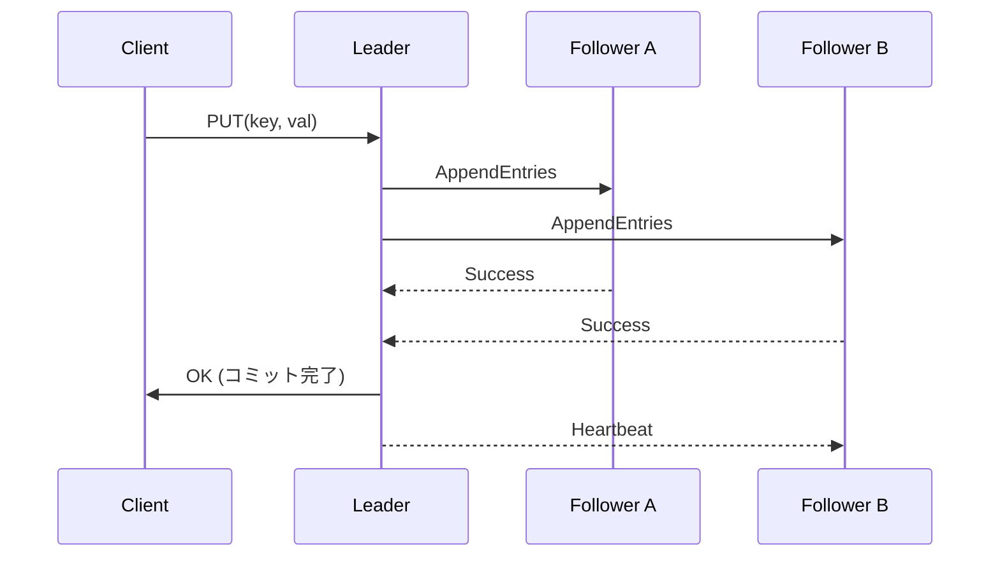

## 目次

<br />

## はじめに

分散システムの理論を実際に手を動かして理解するために作ったプロジェクトです。

Raftコンセンサスアルゴリズムを中心に、分散合意やレプリケーションの仕組みを実装しています。「論文を読んだだけでは分からない」部分を実装を通じて理解することを目的としています。

<br />

## 技術スタック

<br />

### 言語・ランタイム

| 技術 | 説明 |
|------|------|
| **Java 21** | Virtual Threadsを活用した並行処理 |
| **Gradle** | ビルドツール・依存関係管理 |

<br />

### 通信

| 技術 | 説明 |
|------|------|
| **gRPC** | 高速なノード間RPC通信 |
| **Protocol Buffers** | 効率的なシリアライズフォーマット |

<br />

### その他

| 技術 | 説明 |
|------|------|
| **SLF4J + Logback** | ロギング |
| **JUnit 5** | テスト |

<br />

## Raftコンセンサスアルゴリズムとは

Raftは分散システムにおける<strong>合意形成（コンセンサス）</strong>を実現するアルゴリズムです。

複数のサーバー（ノード）が同じ状態を持つように調整し、一部のノードが故障しても全体として正しく動作し続けることを保証します。

<br />

### なぜRaftか

以前から有名なPaxosアルゴリズムは理解が難しいことで知られています。Raftは「理解しやすさ」を設計目標に掲げ、以下の特徴を持ちます：

| 特徴 | 説明 |
|------|------|
| **強いリーダー** | ログはリーダーからフォロワーへ一方向にのみ流れる |
| **リーダー選出** | ランダム化タイムアウトで選出の衝突を回避 |
| **メンバーシップ変更** | Joint Consensusによる安全な構成変更 |

<br />

## システムアーキテクチャ

```mermaid
flowchart TB
    subgraph Cluster["Raft Cluster (3 or 5 nodes)"]
        Leader["Node A<br/>(Leader)"]
        Follower1["Node B<br/>(Follower)"]
        Follower2["Node C<br/>(Follower)"]
    end

    subgraph ClientLayer["Client"]
        Client["KV操作<br/>get, put, delete"]
    end

    Client -->|リクエスト| Leader
    Leader -->|レプリケーション| Follower1
    Leader -->|レプリケーション| Follower2
    Leader -->|レスポンス| Client
    Follower1 -.->|Heartbeat応答| Leader
    Follower2 -.->|Heartbeat応答| Leader

    style Leader fill:#134e4a,stroke:#5eead4,stroke-width:2px
    style Client fill:#1e3a5f,stroke:#60a5fa,stroke-width:2px
```



<br />

## 実装した内容

<br />

### 1. ノードの状態遷移

Raftのノードは3つの状態を持ちます：

```mermaid
stateDiagram-v2
    [*] --> Follower
    Follower --> Candidate: 選挙タイムアウト
    Candidate --> Leader: 過半数の票を獲得
    Candidate --> Follower: 他のリーダーを発見
    Leader --> Follower: 他のリーダーを発見
    Candidate --> Candidate: 投票の分裂

    classDef leader fill:#134e4a,stroke:#5eead4,stroke-width:2px
    classDef candidate fill:#78350f,stroke:#fbbf24,stroke-width:2px
    classDef follower fill:#1e3a5f,stroke:#60a5fa,stroke-width:2px

    class Leader leader
    class Candidate candidate
    class Follower follower
```



<br />

#### 実装コード

```java
public enum NodeState {
    FOLLOWER,
    CANDIDATE,
    LEADER
}

public class RaftNode {
    private volatile NodeState state = NodeState.FOLLOWER;
    private volatile int currentTerm = 0;
    private volatile String votedFor = null;
    private final String nodeId;
    private final List<String> peers;

    // リーダーからのハートビートを受信したとき
    public synchronized void onHeartbeatReceived(int leaderTerm) {
        if (leaderTerm >= currentTerm) {
            currentTerm = leaderTerm;
            state = NodeState.FOLLOWER;
            resetElectionTimer();
        }
    }

    // 選挙タイムアウトが発生したとき
    public synchronized void onElectionTimeout() {
        if (state != NodeState.LEADER) {
            startElection();
        }
    }
}
```

<br />

### 2. リーダー選出 (Leader Election)

選挙プロセスの流れ：

1. **選挙タイムアウト**発生 → Followerが**Candidate**に遷移
2. **Term（任期）をインクリメント**
3. **自分に投票** + 他ノードに**RequestVote RPC**を送信
4. **過半数の票**を獲得 → **Leader**に遷移
5. 他のLeaderを発見 → **Follower**に戻る

<br />

#### なぜランダムタイムアウトか

選挙タイムアウトを150-300msの範囲でランダムに設定することで、複数ノードが同時にCandidateになる確率を下げています。これにより<strong>Split Vote(票の分散)</strong>を回避できます。

```java
private static final int ELECTION_TIMEOUT_MIN_MS = 150;
private static final int ELECTION_TIMEOUT_MAX_MS = 300;

private int getRandomElectionTimeout() {
    return ThreadLocalRandom.current()
        .nextInt(ELECTION_TIMEOUT_MIN_MS, ELECTION_TIMEOUT_MAX_MS + 1);
}
```

<br />

#### 選挙の実装

```java
public void startElection() {
    state = NodeState.CANDIDATE;
    currentTerm++;
    votedFor = nodeId;
    int votes = 1; // 自分への投票

    log.info("Node {} starting election for term {}", nodeId, currentTerm);

    // Virtual Threadsで並行にRequestVoteを送信
    List<CompletableFuture<Boolean>> futures = peers.stream()
        .map(peer -> CompletableFuture.supplyAsync(() -> {
            try {
                RequestVoteResponse response = sendRequestVote(peer,
                    RequestVoteRequest.newBuilder()
                        .setTerm(currentTerm)
                        .setCandidateId(nodeId)
                        .setLastLogIndex(log.getLastIndex())
                        .setLastLogTerm(log.getLastTerm())
                        .build()
                );
                return response.getVoteGranted();
            } catch (Exception e) {
                log.warn("Failed to get vote from {}", peer, e);
                return false;
            }
        }, executor))
        .toList();

    // 結果を集計
    for (CompletableFuture<Boolean> future : futures) {
        try {
            if (future.get(ELECTION_TIMEOUT_MIN_MS, TimeUnit.MILLISECONDS)) {
                votes++;
            }
        } catch (Exception e) {
            // タイムアウトまたは失敗
        }
    }

    // 過半数の票を獲得したらLeaderに
    if (votes > (peers.size() + 1) / 2) {
        becomeLeader();
    }
}

private void becomeLeader() {
    state = NodeState.LEADER;
    log.info("Node {} became leader for term {}", nodeId, currentTerm);

    // 全Followerのnext/matchIndexを初期化
    for (String peer : peers) {
        nextIndex.put(peer, log.getLastIndex() + 1);
        matchIndex.put(peer, 0);
    }

    // ハートビート送信開始
    startHeartbeat();
}
```

<br />

### 3. ログレプリケーション (Log Replication)

クライアントからの書き込み要求をログとして全ノードに複製する仕組みです。

<br />

#### レプリケーションの流れ



<br />

#### 実装コード

```java
public class LogEntry {
    private final int term;
    private final int index;
    private final Command command;

    public LogEntry(int term, int index, Command command) {
        this.term = term;
        this.index = index;
        this.command = command;
    }
}

public CompletableFuture<Boolean> appendEntry(Command command) {
    if (state != NodeState.LEADER) {
        return CompletableFuture.completedFuture(false);
    }

    // ログにエントリを追加
    LogEntry entry = new LogEntry(currentTerm, log.getLastIndex() + 1, command);
    log.append(entry);

    // Virtual Threadsで並行にAppendEntriesを送信
    AtomicInteger acks = new AtomicInteger(1); // 自分はすでにOK

    List<CompletableFuture<Void>> futures = peers.stream()
        .map(peer -> CompletableFuture.runAsync(() -> {
            try {
                AppendEntriesResponse response = sendAppendEntries(peer, entry);
                if (response.getSuccess()) {
                    acks.incrementAndGet();
                    nextIndex.put(peer, entry.getIndex() + 1);
                    matchIndex.put(peer, entry.getIndex());
                } else {
                    // ログの不整合 → nextIndexをデクリメントしてリトライ
                    nextIndex.compute(peer, (k, v) -> Math.max(1, v - 1));
                }
            } catch (Exception e) {
                log.warn("Failed to replicate to {}", peer, e);
            }
        }, executor))
        .toList();

    // 結果を待機
    return CompletableFuture.allOf(futures.toArray(new CompletableFuture[0]))
        .thenApply(v -> {
            // 過半数がACKしたらコミット
            if (acks.get() > (peers.size() + 1) / 2) {
                commitIndex = entry.getIndex();
                applyToStateMachine(entry);
                return true;
            }
            return false;
        });
}
```

<br />

### 4. gRPCによるノード間通信

Protocol Buffersでメッセージを定義し、gRPCでRPCを実装しています。

<br />

#### Protocol Buffers定義

```protobuf
syntax = "proto3";

package raft;

option java_package = "com.haroin57.raft.proto";
option java_multiple_files = true;

service RaftService {
    // 投票要求
    rpc RequestVote(RequestVoteRequest) returns (RequestVoteResponse);

    // ログ追加（ハートビートも兼用）
    rpc AppendEntries(AppendEntriesRequest) returns (AppendEntriesResponse);
}

message RequestVoteRequest {
    int32 term = 1;
    string candidate_id = 2;
    int32 last_log_index = 3;
    int32 last_log_term = 4;
}

message RequestVoteResponse {
    int32 term = 1;
    bool vote_granted = 2;
}

message LogEntry {
    int32 term = 1;
    int32 index = 2;
    bytes command = 3;
}

message AppendEntriesRequest {
    int32 term = 1;
    string leader_id = 2;
    int32 prev_log_index = 3;
    int32 prev_log_term = 4;
    repeated LogEntry entries = 5;
    int32 leader_commit = 6;
}

message AppendEntriesResponse {
    int32 term = 1;
    bool success = 2;
}
```

<br />

#### gRPC サーバー実装

```java
public class RaftServiceImpl extends RaftServiceGrpc.RaftServiceImplBase {
    private final RaftNode node;

    @Override
    public void requestVote(RequestVoteRequest request,
                           StreamObserver<RequestVoteResponse> responseObserver) {
        boolean granted = node.handleRequestVote(
            request.getTerm(),
            request.getCandidateId(),
            request.getLastLogIndex(),
            request.getLastLogTerm()
        );

        responseObserver.onNext(RequestVoteResponse.newBuilder()
            .setTerm(node.getCurrentTerm())
            .setVoteGranted(granted)
            .build());
        responseObserver.onCompleted();
    }

    @Override
    public void appendEntries(AppendEntriesRequest request,
                             StreamObserver<AppendEntriesResponse> responseObserver) {
        boolean success = node.handleAppendEntries(
            request.getTerm(),
            request.getLeaderId(),
            request.getPrevLogIndex(),
            request.getPrevLogTerm(),
            request.getEntriesList(),
            request.getLeaderCommit()
        );

        responseObserver.onNext(AppendEntriesResponse.newBuilder()
            .setTerm(node.getCurrentTerm())
            .setSuccess(success)
            .build());
        responseObserver.onCompleted();
    }
}
```

<br />

### 5. 分散キーバリューストア

Raftの上にシンプルなKVストアを構築しています。

```java
public interface KeyValueStore {
    CompletableFuture<Void> put(String key, String value);
    String get(String key);
    CompletableFuture<Void> delete(String key);
}

public class RaftKeyValueStore implements KeyValueStore {
    private final RaftNode raftNode;
    private final ConcurrentHashMap<String, String> data = new ConcurrentHashMap<>();

    @Override
    public CompletableFuture<Void> put(String key, String value) {
        Command cmd = new PutCommand(key, value);
        return raftNode.appendEntry(cmd)
            .thenAccept(success -> {
                if (!success) {
                    throw new NotLeaderException();
                }
            });
    }

    @Override
    public String get(String key) {
        // 読み取りはローカルから（Follower Readの場合）
        // 強い一貫性が必要な場合はLeader経由
        return data.get(key);
    }

    // ステートマシンへの適用
    public void apply(Command command) {
        if (command instanceof PutCommand put) {
            data.put(put.getKey(), put.getValue());
        } else if (command instanceof DeleteCommand delete) {
            data.remove(delete.getKey());
        }
    }
}
```

<br />

### 6. 障害検知とフェイルオーバー

ノードの障害を検知して自動的にリーダーを再選出します。

| パラメータ | 値 | 説明 |
|-----------|-----|------|
| Heartbeat間隔 | 50ms | Leaderが送信する間隔 |
| 選挙タイムアウト | 150-300ms | ランダム化して衝突回避 |
| RPC タイムアウト | 100ms | 通信タイムアウト |

<br />

## 学んだこと

<br />

### CAP定理の実感

分散システムでは「一貫性（Consistency）」「可用性（Availability）」「分断耐性（Partition Tolerance）」のうち2つしか同時に満たせません。

Raftは<strong>CP(一貫性 + 分断耐性)</strong>を選択しています：

- 過半数のノードが利用不可 → 書き込み停止
- データの一貫性は常に保証

```mermaid
flowchart TB
    C["<strong>Consistency</strong><br/>一貫性"]
    A["Availability<br/>可用性"]
    P["<strong>Partition Tolerance</strong><br/>分断耐性"]

    C ---|"Raft"| P
    C -.-|"×"| A
    A -.-|"×"| P

    style C fill:#134e4a,stroke:#5eead4,stroke-width:2px
    style P fill:#134e4a,stroke:#5eead4,stroke-width:2px
```



<br />

### 分散システム特有の難しさ

| 課題 | 説明 |
|------|------|
| **ネットワーク遅延** | メッセージの到着順序が保証されない |
| **ネットワーク分断** | 一部のノードと通信不能になる |
| **クロックの同期** | 各ノードの時計がずれる |
| **障害の種類** | クラッシュ、ビザンチン障害など |
| **再試行の冪等性** | 同じ操作を複数回実行しても結果が変わらない設計 |

<br />

### デバッグの大変さ

複数ノードが非同期に動作するため、バグの再現が困難です。

対策として実施したこと：

1. **詳細なログ出力** - イベントの順序を追跡
2. **論理クロック** - 因果関係を把握
3. **決定論的テスト** - 乱数シードを固定

```java
// イベントログの例
log.info("[Term={}][Node={}][State={}] {}",
    currentTerm, nodeId, state, "Received AppendEntries from " + leaderId);
```

<br />

## テスト

<br />

### 単体テスト

各コンポーネントを個別にテスト：

```java
@Test
void shouldGrantVoteIfTermIsHigher() {
    RaftNode node = new RaftNode("node1", List.of("node2", "node3"));

    boolean granted = node.handleRequestVote(
        /* term */ 2,
        /* candidateId */ "node2",
        /* lastLogIndex */ 0,
        /* lastLogTerm */ 0
    );

    assertThat(granted).isTrue();
    assertThat(node.getVotedFor()).isEqualTo("node2");
}
```

<br />

### 統合テスト

複数ノードを起動して実際の動作を確認：

```java
@Test
void shouldElectLeaderIn3NodeCluster() throws Exception {
    // 3ノードのクラスタを起動
    List<RaftNode> nodes = startCluster(3);

    // リーダーが選出されるまで待機
    await().atMost(Duration.ofSeconds(5))
        .until(() -> countLeaders(nodes) == 1);

    // 1つだけリーダーがいることを確認
    assertThat(countLeaders(nodes)).isEqualTo(1);
}

@Test
void shouldReelectLeaderWhenLeaderFails() throws Exception {
    List<RaftNode> nodes = startCluster(3);
    await().until(() -> countLeaders(nodes) == 1);

    // リーダーを停止
    RaftNode leader = findLeader(nodes);
    leader.shutdown();

    // 新しいリーダーが選出されるまで待機
    await().atMost(Duration.ofSeconds(5))
        .until(() -> countLeaders(nodes) == 1);
}
```

<br />

## 参考資料

- [In Search of an Understandable Consensus Algorithm (Raft論文)](https://raft.github.io/raft.pdf)
- [The Raft Consensus Algorithm](https://raft.github.io/)
- [Raft Visualization](http://thesecretlivesofdata.com/raft/)
- [Designing Data-Intensive Applications](https://dataintensive.net/)

<br />

## 今後の改善予定

- [ ] ログの永続化（ファイル保存）
- [ ] 簡易的なCLIクライアントの作成
- [ ] ノードの状態をWebで可視化
- [ ] テストカバレッジの向上
- [ ] READMEの充実

<br />

## まとめ

分散システムは理論を読むだけでは理解が難しく、実際に実装してみることで多くの気づきがありました。

特に以下の点は、実装して初めて腑に落ちました：

- リーダー選出で**なぜランダムなタイムアウトが必要か**
- ログレプリケーションで**なぜ過半数で良いのか**
- **ネットワーク分断時にどう振る舞うか**

Raftは「理解しやすい」を目指したアルゴリズムですが、それでも実装には多くの edge case があり、分散システムの難しさを実感しました。

<br />

ソースコード: [haroin57/distributed-system](https://github.com/haroin57/distoributed-system)
