## 目次

<br />

## はじめに

このサイト（haroin57.com）自体がProductsの1つです。React 19とViteを使って構築し、Cloudflare Pagesにデプロイしています。

パフォーマンスとユーザー体験を重視して設計しました。モダンなReactの機能をフル活用しつつ、Web Vitals（特にINP）の最適化に注力しています。

<br />

## 技術スタック

<br />

### フロントエンド

| 技術 | 説明 |
|------|------|
| **React 19** | 最新のReact。React Compilerによる自動最適化を有効化 |
| **TypeScript** | 型安全な開発。strict modeで運用 |
| **Tailwind CSS v4** | ユーティリティファーストなスタイリング |
| **React Router v7** | クライアントサイドルーティング |

<br />

### ビルドツール

| 技術 | 説明 |
|------|------|
| **Vite 7** | 高速な開発サーバーとビルド |
| **Rolldown** | ESBuildの代替。Rustベースでさらなる高速化 |
| **React Compiler** | useMemo/useCallbackの自動挿入 |

<br />

### デプロイ・インフラ

| 技術 | 説明 |
|------|------|
| **Cloudflare Pages** | グローバルCDNによる高速配信 |
| **Cloudflare Workers** | アクセスカウンターのバックエンド |
| **Cloudflare KV** | いいね数などの永続化ストレージ |

<br />

## アーキテクチャ

```mermaid
flowchart TB
    subgraph Edge["Cloudflare Edge"]
        Pages["Pages<br/>(静的配信)"]
        Workers["Workers<br/>(API処理)"]
        KV["KV<br/>(データ保存)"]
    end

    subgraph Client["React SPA (Client)"]
        Router["Router<br/>(React Router v7)"]
        PageComponents["Pages<br/>(Home, Posts, Products)"]
        Components["Components<br/>(UI部品)"]
    end

    Pages --> Router
    Router --> PageComponents
    PageComponents --> Components
    PageComponents <--> Workers
    Workers <--> KV

    style Pages fill:#f97316,stroke:#fdba74,stroke-width:2px,color:#fff
    style Router fill:#134e4a,stroke:#5eead4,stroke-width:2px
    style KV fill:#3b2f4a,stroke:#a78bfa,stroke-width:2px
```



<br />

## 主な機能と実装詳細

<br />

### 1. ページ遷移アニメーション

`react-transition-group` の `CSSTransition` を使用してページ間の遷移をスムーズにしています。

```tsx
import { CSSTransition, TransitionGroup } from 'react-transition-group'

<TransitionGroup component={null}>
  <CSSTransition
    key={location.pathname}
    classNames="page-transition"
    timeout={300}
  >
    <Routes location={location}>
      {/* ルート定義 */}
    </Routes>
  </CSSTransition>
</TransitionGroup>
```

CSSでは以下のようにアニメーションを定義：

```css
.page-transition-enter {
  opacity: 0;
  transform: translateY(10px);
}
.page-transition-enter-active {
  opacity: 1;
  transform: translateY(0);
  transition: opacity 300ms, transform 300ms;
}
.page-transition-exit {
  opacity: 1;
}
.page-transition-exit-active {
  opacity: 0;
  transition: opacity 200ms;
}
```

<br />

### 2. INP（Interaction to Next Paint）最適化

ユーザーインタラクションの応答性を向上させるため、複数の最適化を実施しています。

<br />

#### startTransitionによる優先度制御

状態更新の優先度を制御し、UIのブロッキングを防止：

```tsx
import { startTransition } from 'react'

const handleTagSelect = (tag: string) => {
  startTransition(() => {
    // 低優先度の状態更新
    setSearchParams(nextParams)
  })
}
```

<br />

#### content-visibilityによる遅延レンダリング

オフスクリーンのコンテンツをレンダリングスキップ：

```css
.post-content {
  content-visibility: auto;
  contain-intrinsic-size: 0 500px;
}
```

<br />

#### React.lazyによる動的インポート

重いコンポーネントを必要時にのみ読み込み：

```tsx
const PostDetail = lazy(() => import('./routes/PostDetail'))
const ProductDetail = lazy(() => import('./routes/ProductDetail'))
```

<br />

### 3. Markdownブログシステム

`remark` / `rehype` エコシステムを使用してMarkdownをHTMLに変換しています。

<br />

#### 使用プラグイン

| プラグイン | 用途 |
|-----------|------|
| **remark-gfm** | GitHub Flavored Markdown（テーブル、タスクリストなど） |
| **remark-math** | 数式記法のパース |
| **rehype-katex** | KaTeXによる数式レンダリング |
| **rehype-pretty-code** | shikiによるシンタックスハイライト |
| **remark-toc** | 目次の自動生成 |

<br />

#### ビルド時処理フロー

```mermaid
flowchart LR
    MD[".md files<br/>(content/)"] --> Matter["gray-matter<br/>(frontmatter)"]
    Matter --> Remark["remark<br/>(parse MD)"]
    Remark --> Rehype["rehype<br/>(HTML変換)"]
    Rehype --> JSON["posts.json<br/>(出力)"]

    style MD fill:#1e3a5f,stroke:#60a5fa,stroke-width:2px
    style JSON fill:#134e4a,stroke:#5eead4,stroke-width:2px
```



<br />

#### 数式レンダリング例

```markdown
$$
E = mc^2
$$
```

のような記法で数式が書けます。実際の表示例:

$$
E = mc^2
$$

インライン数式も対応しています：$f(x) = ax^2 + bx + c$

<br />

### 4. スクロール連動背景エフェクト

投稿詳細ページでは、スクロールに応じて背景にブラーエフェクトを適用しています。

```tsx
useEffect(() => {
  const startPx = 48
  const rangePx = 420
  const maxBlurPx = 5

  const update = () => {
    const y = window.scrollY || 0
    const t = Math.max(0, Math.min(1, (y - startPx) / rangePx))
    const blur = t * maxBlurPx

    document.body.style.setProperty('--bg-blur', `${blur}px`)
  }

  const onScroll = () => {
    requestAnimationFrame(update)
  }

  window.addEventListener('scroll', onScroll, { passive: true })
  return () => window.removeEventListener('scroll', onScroll)
}, [])
```

<br />

### 5. Adobe Fontsの最適化

Adobe Fontsを使用していますが、ロード時間を最小化するために以下を実施：

- **dns-prefetch / preconnect** でDNS解決を事前に実行
- フォント読み込み前はシステムフォントにフォールバック
- **font-display: swap** で表示のブロッキングを回避

```html
<link rel="preconnect" href="https://use.typekit.net" crossorigin />
<link rel="dns-prefetch" href="https://use.typekit.net" />
```

<br />

## パフォーマンス最適化

<br />

### Cloudflare Edge Caching

| リソース | キャッシュ戦略 |
|---------|---------------|
| 静的アセット（JS/CSS/画像） | 長期キャッシュ（1年）+ immutable |
| HTML | 短いTTL（5分）で鮮度維持 |
| API レスポンス | KVによる永続化 |

<br />

### 画像最適化

- **WebP形式**を採用（JPEG比30-40%軽量化）
- `loading="lazy"` で遅延読み込み
- 適切なサイズの画像を提供（srcset未使用だが検討中）

<br />

### バンドルサイズ削減

| 手法 | 効果 |
|------|------|
| Tree Shaking | 未使用コードの除去 |
| Code Splitting | ルートベースの分割 |
| Dynamic Import | 必要時のみロード |

<br />

## 開発体験

<br />

### HMR（Hot Module Replacement）

Vite + Rolldownにより、ファイル変更から画面反映まで**50ms以下**を実現。

<br />

### 型安全性

TypeScript strict modeに加え、以下で型安全性を強化：

- eslint-plugin-react-compiler による React Compiler互換性チェック
- 明示的な型アノテーション必須化

<br />

## 今後の改善予定

- [ ] 記事の検索機能追加
- [ ] ダークモード/ライトモードの切り替えボタン
- [ ] 記事の目次をサイドバーに表示
- [ ] コードブロックのファイル名表示
- [ ] 関連記事の表示

<br />

## まとめ

モダンなReactの機能を活用しつつ、パフォーマンスにも気を配ったサイトを構築できました。

特にReact 19 + React Compilerの組み合わせは、手動でのメモ化を不要にし、開発体験を大幅に向上させてくれます。Vite + Rolldownによるビルドも高速で、開発イテレーションが非常にスムーズです。

<br />

ソースコードはGitHubで公開しています: [haroin57/haroin57.com](https://github.com/haroin57/haroin57.com)
