## 目次

<br />

## はじめに

大学の時間割を管理するために作ったLINE Botです。LINEで話しかけるだけで時間割の確認やリマインダー設定ができます。

**GPTを使ってユーザーのメッセージを解析**し、自然な日本語から構造化データ（JSON）を抽出しています。これにより、厳密なコマンド形式を覚えなくても直感的に操作できます。

毎日の授業管理をもっと楽にしたいという動機から開発しました。「今日の授業なんだっけ？」をLINEで即座に確認できるのが便利です。

<br />

## 技術スタック

<br />

### ランタイム・言語

| 技術 | 説明 |
|------|------|
| **Python 3.11+** | メイン言語。型ヒント活用 |
| **FastAPI** | 非同期対応Webフレームワーク |

<br />

### 外部サービス・API

| 技術 | 説明 |
|------|------|
| **LINE Messaging API** | LINEとの連携 |
| **LINE Messaging API SDK** | Python SDK |
| **OpenAI API (GPT)** | メッセージ解析・JSON抽出 |

<br />

### データベース

| 技術 | 説明 |
|------|------|
| **SQLite** | 軽量で扱いやすいDB |
| **APScheduler** | リマインダーのスケジューリング |

<br />

## システムアーキテクチャ

```mermaid
flowchart TB
    subgraph LINE["LINE Platform"]
        User["LINE App<br/>(User)"]
        API["Messaging API"]
    end

    subgraph Server["FastAPI Server"]
        Webhook["Webhook Handler"]
        GPT["OpenAI GPT<br/>(メッセージ解析)"]
        Response["Response Builder"]
    end

    subgraph Data["Data Layer"]
        Scheduler["APScheduler<br/>(リマインダー)"]
        DB["SQLite<br/>(Database)"]
    end

    User <-->|メッセージ/画像| API
    API -->|Webhook| Webhook
    Webhook --> GPT
    GPT -->|JSON抽出| Response
    Response -->|返信| API
    Scheduler -->|Push通知| API
    GPT <--> DB
    Scheduler <--> DB

    style GPT fill:#134e4a,stroke:#5eead4,stroke-width:2px
    style User fill:#1e3a5f,stroke:#60a5fa,stroke-width:2px
    style DB fill:#3b2f4a,stroke:#a78bfa,stroke-width:2px
```



<br />

## 主な機能

<br />

### 1. 時間割の登録

テキストまたは画像で時間割を登録できます。GPTが自然言語を解析するため、厳密なコマンド形式を覚える必要はありません。

<br />

#### テキストで登録

```
月曜1限 解析学 C3 101
火曜2限 英語 A棟201
```

のように送信すると、GPTが内容を解析して確認メッセージを返します：

```
この内容で実行しますか？はい / いいえ
```

「はい」と答えると登録が完了し、結果が表示されます：

```
授業を追加しました。内訳は以下です。
誤りがあれば「追加」「削除」「置換」で修正できます。

- 月 09:00-10:30 解析学 / 教室: C3 101
- 火 10:40-12:10 英語 / 教室: A棟201
```

<br />

#### 画像で登録

時間割の画像（スクリーンショットなど）を送信すると、GPT-4o Visionが内容を読み取って登録できます。

```
画像から時間割を登録しました。内訳は以下です。
```

<br />

### 2. 時間割の編集・削除

<br />

#### 追加

```
追加 水曜3限 プログラミング PC室1
```

<br />

#### 削除

```
削除 月曜1限
```

<br />

#### 置換（修正・変更）

```
置換 月曜1限 微分積分 B棟301
```

`修正` や `変更` でも同様に動作します。

<br />

#### 教室の変更

```
教室 月曜1限 C棟102
```

`場所`、`location`、`room` でも同様に動作します。

<br />

#### 時刻の変更

```
時間 月曜1限 09:30 11:00
```

`時間変更`、`time`、`時刻` でも同様に動作します。

<br />

#### 全削除

```
リセット
```

`reset`、`クリア`、`clear` で全時間割を削除できます。

<br />

### 3. スケジュール表示

<br />

#### 一覧表示

```
一覧
```

と送信すると、登録済みの時間割を表示します：

```
- 月 09:00-10:30 解析学 / 教室: C3 101
- 火 10:40-12:10 英語 / 教室: 未設定
- 水 13:00-14:30 プログラミング / 教室: PC室1
```

`確認`、`時間割`、`schedule`、`list` でも同様に表示されます。

<br />

### 4. リマインダー通知

授業開始**10分前**に自動でプッシュ通知を送信します（デフォルト設定）。

時間割を登録すると、APSchedulerが各曜日・時刻にジョブを登録し、該当時刻に通知を送信します。

<br />

### 5. ヘルプ

```
ヘルプ
```

と送信すると、使い方の一覧を表示します。`help`、`使い方` でも同様です。

<br />

## 実装詳細

<br />

### Webhook処理

LINE Messaging APIからのWebhookを受け取り、HMAC SHA256で署名検証後、非同期でメッセージを処理します。

```python
from fastapi import FastAPI, Request, BackgroundTasks
import hmac
import hashlib

app = FastAPI()

@app.post("/callback")
async def callback(request: Request, background_tasks: BackgroundTasks):
    body = await request.body()
    signature = request.headers.get("x-line-signature")

    # HMAC SHA256 署名検証
    hash_value = hmac.new(
        LINE_CHANNEL_SECRET.encode(),
        body,
        hashlib.sha256
    ).digest()

    if not hmac.compare_digest(signature, base64.b64encode(hash_value).decode()):
        raise HTTPException(status_code=400)

    # 非同期でイベント処理
    events = json.loads(body)["events"]
    for event in events:
        background_tasks.add_task(handle_event, event)

    return "OK"
```

<br />

### GPTによるメッセージ解析

正規表現の代わりに**OpenAI GPTを使用**して、自然言語のメッセージから構造化されたJSONを抽出しています。これにより、ユーザーは厳密なコマンド形式を覚える必要がありません。

```python
from openai import OpenAI

def call_chatgpt_to_extract_schedule(timetable_text: str, model: str = "gpt-4o-mini"):
    """GPTを使って時間割情報をJSON形式で抽出"""

    system_prompt = """You are a strict JSON extractor for university timetables.
    Extract schedule information and return ONLY valid JSON in this format:
    {
        "action": "add" | "delete" | "replace" | "show",
        "entries": [
            {
                "day": "月" | "火" | "水" | "木" | "金",
                "period": 1-5,
                "subject": "科目名",
                "room": "教室名"
            }
        ]
    }
    """

    client = OpenAI()
    response = client.chat.completions.create(
        model=model,
        messages=[
            {"role": "system", "content": system_prompt},
            {"role": "user", "content": timetable_text}
        ],
        response_format={"type": "json_object"}
    )

    return json.loads(response.choices[0].message.content)
```

<br />

### 画像からの時間割抽出

GPT-4oのビジョン機能を使って、**時間割の画像からも情報を抽出**できます。

```python
import base64

def call_chatgpt_to_extract_schedule_from_image(image_data: bytes):
    """画像から時間割情報を抽出"""

    base64_image = base64.b64encode(image_data).decode()

    client = OpenAI()
    response = client.chat.completions.create(
        model="gpt-4o",
        messages=[
            {
                "role": "user",
                "content": [
                    {"type": "text", "text": "この時間割画像から授業情報をJSON形式で抽出してください"},
                    {
                        "type": "image_url",
                        "image_url": {"url": f"data:image/jpeg;base64,{base64_image}"}
                    }
                ]
            }
        ]
    )

    return json.loads(response.choices[0].message.content)
```

<br />

### 時限から時刻へのマッピング

「1限」などの表現を具体的な開始・終了時刻に変換します。

```python
DEFAULT_PERIOD_MAP = {
    "1": {"start": "09:00", "end": "10:30"},
    "2": {"start": "10:40", "end": "12:10"},
    "3": {"start": "13:00", "end": "14:30"},
    "4": {"start": "14:40", "end": "16:10"},
    "5": {"start": "16:20", "end": "17:50"},
}

def get_period_time(period: int) -> dict:
    return DEFAULT_PERIOD_MAP.get(str(period), {})
```

<br />

### データベース設計

シンプルなテーブル構成で、ユーザーごとの時間割を管理しています。

```sql
-- 時間割テーブル
CREATE TABLE timetable (
    id INTEGER PRIMARY KEY AUTOINCREMENT,
    user_id TEXT NOT NULL,
    day_of_week INTEGER NOT NULL,  -- 0=月, 1=火, ..., 6=日
    period INTEGER NOT NULL,        -- 1限, 2限, ...
    subject TEXT NOT NULL,
    room TEXT,
    created_at TIMESTAMP DEFAULT CURRENT_TIMESTAMP,
    updated_at TIMESTAMP DEFAULT CURRENT_TIMESTAMP,

    UNIQUE(user_id, day_of_week, period)
);

-- リマインダー設定テーブル
CREATE TABLE reminder_settings (
    user_id TEXT PRIMARY KEY,
    enabled INTEGER DEFAULT 1,
    minutes_before INTEGER DEFAULT 10,
    updated_at TIMESTAMP DEFAULT CURRENT_TIMESTAMP
);

-- 時限マスタテーブル
CREATE TABLE period_times (
    period INTEGER PRIMARY KEY,
    start_time TEXT NOT NULL,  -- 'HH:MM'
    end_time TEXT NOT NULL     -- 'HH:MM'
);

-- 初期データ
INSERT INTO period_times VALUES
    (1, '09:00', '10:30'),
    (2, '10:45', '12:15'),
    (3, '13:15', '14:45'),
    (4, '15:00', '16:30'),
    (5, '16:45', '18:15');
```

<br />

### リマインダーのスケジューリング

`APScheduler` を使って定期的に通知をチェック・送信しています。

```python
from apscheduler.schedulers.background import BackgroundScheduler
from datetime import datetime, timedelta
import pytz

JST = pytz.timezone("Asia/Tokyo")

def check_and_send_reminders():
    """毎分実行：リマインダー対象の授業をチェックして通知"""
    now = datetime.now(JST)
    current_day = now.weekday()  # 0=月曜

    # リマインダーが有効なユーザーを取得
    users = get_users_with_reminder_enabled()

    for user in users:
        minutes_before = user.minutes_before
        target_time = now + timedelta(minutes=minutes_before)

        # 対象時刻に開始する授業を検索
        classes = get_classes_starting_at(
            user_id=user.user_id,
            day=current_day,
            time=target_time.strftime("%H:%M")
        )

        for cls in classes:
            send_reminder_notification(user.user_id, cls)

# スケジューラー設定
scheduler = BackgroundScheduler(timezone="Asia/Tokyo")
scheduler.add_job(
    check_and_send_reminders,
    "cron",
    minute="*/1"  # 毎分実行
)
scheduler.start()
```

<br />

### タイムゾーン対応

サーバーのタイムゾーンと日本時間のずれに注意が必要でした。`pytz` で明示的にJSTを指定しています。

```python
from datetime import datetime
import pytz

JST = pytz.timezone("Asia/Tokyo")

def get_current_day_of_week() -> int:
    """現在の曜日を取得（0=月曜）"""
    now = datetime.now(JST)
    return now.weekday()

def get_today_date_string() -> str:
    """今日の日付を日本語で取得"""
    now = datetime.now(JST)
    days = ["月", "火", "水", "木", "金", "土", "日"]
    return f"{now.month}月{now.day}日（{days[now.weekday()]}曜日）"
```

<br />

## 苦労したポイント

<br />

### 1. GPTによる柔軟なメッセージ解析

ユーザーは様々な形式でメッセージを送ってきます：

- `月曜の1限に数学を追加して`
- `月曜1限 数学 301教室`
- `明日の2限は休講`

正規表現で全パターンに対応するのは困難でした。GPTを使うことで、**自然言語のまま**情報を抽出できるようになり、ユーザーは厳密なコマンド形式を覚える必要がなくなりました。

ただし、GPTのレスポンスが常に期待通りのJSON形式とは限らないため、**フォールバック処理**（正規表現ベースの簡易パーサー）も実装しています。

<br />

### 2. リマインダーの正確性

1分単位でチェックしているため、タイミングがずれることがあります。現在は「X分前」ではなく「X分前〜X+1分前」の範囲でマッチするようにしています。

<br />

### 3. 複数ユーザー対応

各ユーザーの時間割を分離して管理する必要があります。`user_id`を必ずすべてのクエリに含め、データの混同を防いでいます。

<br />

## 今後の改善予定

- [ ] Flex Messageを使ったカード形式の表示
- [ ] 休講情報の登録機能
- [ ] 教室変更の通知機能
- [ ] 時間割のエクスポート（テキスト形式）
- [ ] リマインダーの通知タイミング変更機能

<br />

## 開発で学んだこと

<br />

### LINE Bot開発の基礎

- Webhookの仕組みとHMAC SHA256署名検証の重要性
- Reply/Pushメッセージの違いと使い分け
- 画像・ファイルのダウンロード処理

<br />

### GPT APIの活用

- プロンプトエンジニアリングの重要性
- JSON形式での出力指定（`response_format`）
- GPT-4oのビジョン機能を使った画像解析
- APIコスト管理とモデル選択（gpt-4o-mini vs gpt-4o）

<br />

### Pythonでの非同期処理

- FastAPIと`BackgroundTasks`による非同期処理
- APSchedulerでの定期実行
- タイムゾーン（JST）の取り扱い

<br />

## まとめ

毎日使うツールを自分で作れるのはプログラミングの醍醐味だと思います。

GPTを使うことで、正規表現では対応しきれない**自然言語の解析**が驚くほど簡単になりました。「月曜1限に数学追加」でも「明日の1コマ目、線形代数」でも、GPTが意図を理解してJSONに変換してくれます。

画像からの時間割抽出も実装でき、スクリーンショットを送るだけで登録できるのは便利です。

このBotを作ったおかげで、授業を忘れることがほぼなくなりました。

<br />

ソースコード: [haroin57/timetable-bot](https://github.com/haroin57/timetable-bot)
