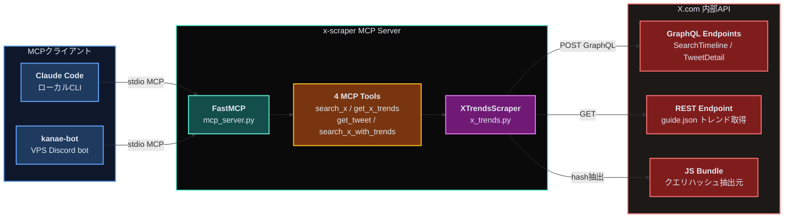
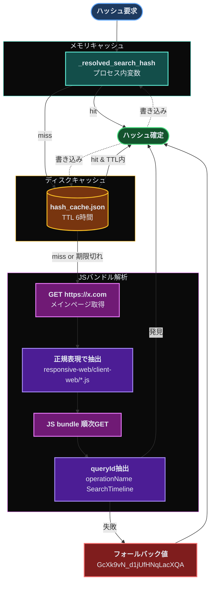
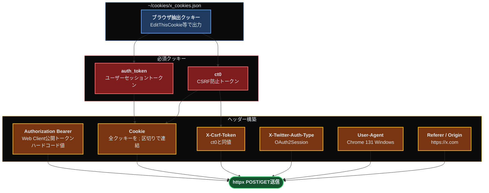
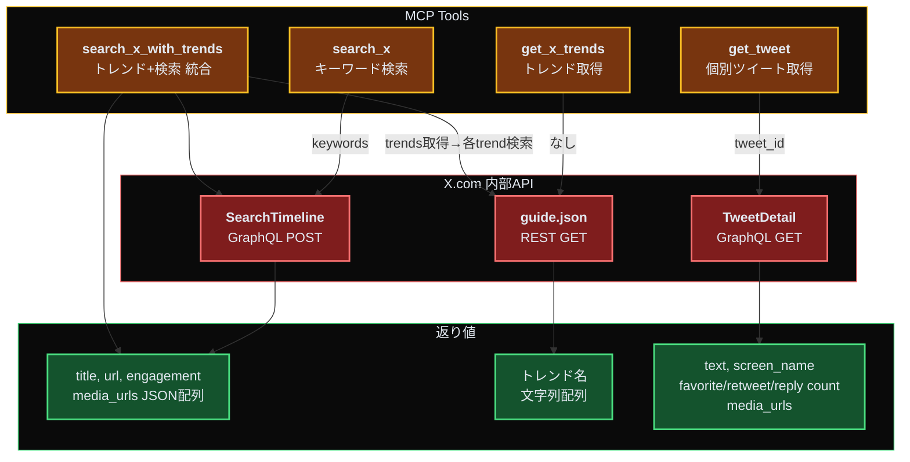

## 概要

x-scraperは、X (Twitter) のGraphQL APIをリバースエンジニアリングし、MCPプロトコル経由で**Claude Code**や**kanae-bot**から直接ツイート検索・トレンド取得・個別ツイート取得を実行できるサーバーです。

公式X APIは$100/月以上の有料プランが必要で、無料枠ではほぼ何もできません。x-scraperは**ブラウザ認証クッキーと内部GraphQL APIを使う**ことで、Web版X.comと同じレベルの情報取得を実現しています。

技術的なポイントは大きく3つ:

1. **GraphQLクエリハッシュの自動抽出** — X.comのJSバンドルを正規表現で解析し、ローテーションするquery hashを自動取得
2. **Cookie + CSRF + Bearer の3層認証** — Web Clientと完全に同一のヘッダーセットで内部APIを叩く
3. **MCP Tool 4種類** — Claude CodeのMCPプロトコルでネイティブツール化

<br/>

## 実運用ユースケース

### 1. リアルタイムリサーチ

「最近のRust async関連のトレンドは？」のような調査依頼に対し、kanae-botがx-scraperを呼び出してX上の生の声を取得します。Web記事には載らない速報・現場の反応を拾えます。

### 2. ニュースキュレーション

kanae-botのnews-curator機能の一部として、トレンド上位20件のツイートを自動収集→重複排除→engagement順にソート→Discordで配信。

### 3. Claude Code MCP連携

ローカルのClaude Codeから `mcp__x-scraper__search_x` を直接呼び出し可能。コーディング中に「このライブラリの最新評判」を確認するのに使えます。

### 4. 個別ツイートの詳細解析

URLを渡すと本文・engagement・画像/動画URLを取得。リプライ・引用元のコンテキスト解析にも使えます。

<br/>

## アーキテクチャ詳解

<br/>

### Layer 1: システム全体像

x-scraperの位置づけと、外部システムとの関係を示します。



MCPクライアント（Claude Code / kanae-bot）はstdio経由でFastMCPサーバーに接続し、4つのToolを呼び出します。Toolは内部的にXTrendsScraperを使ってX.comの内部API（GraphQL + REST）を叩きます。

<br/>

### Layer 2: GraphQLハッシュ自動取得

X.comはGraphQLクエリにビルドハッシュ（query ID）を要求します。これはWebクライアントのバージョン更新で**頻繁にローテーション**するため、ハードコードすると数日で動かなくなります。

x-scraperは**X.comのJSバンドルを正規表現で解析**し、現在有効なqueryIdを自動抽出します。



**3段階のキャッシュ:**

1. **メモリキャッシュ**: プロセス起動中は変数で保持（即時返却）
2. **ディスクキャッシュ**: `cookies/hash_cache.json` に6時間TTLで永続化（MCPサーバー再起動でも生存）
3. **フォールバック**: JS解析が完全に失敗した場合のためのハードコード値

**ハッシュ抽出の正規表現:**

```python
# SearchTimeline用
r'queryId:"([A-Za-z0-9_-]+)",operationName:"SearchTimeline"'

# TweetDetail用（個別ツイート取得）
r'queryId:"([A-Za-z0-9_-]+)",operationName:"TweetDetail"'
```

JSバンドル内の `queryId:"XXX",operationName:"SearchTimeline"` というパターンを探し、XXX部分を抽出します。

<br/>

### Layer 3: 認証ヘッダー構築

X.comの内部GraphQL APIは**3層の認証**を要求します。



**3層認証の役割:**

| 認証要素 | 役割 |
|---------|------|
| **Bearer Token** | Web Client識別。X.com公式Webクライアントのハードコード値を使用 |
| **auth_token (cookie)** | ユーザーセッション。これがログイン状態の本体 |
| **ct0 (cookie + X-Csrf-Token)** | CSRF防止。クッキー値とヘッダー値が一致しないと拒否される |

Bearer Tokenは公開情報（Web版X.comのJSバンドルに埋め込まれている公開鍵）なので、これ自体は秘密ではありません。実質的な認証は `auth_token` と `ct0` のペアで行われます。

<br/>

### Layer 4: ツイート検索フロー

`search_x` ツールが実行されてから結果が返るまでのデータフローです。

```mermaid
flowchart LR
    subgraph Input["入力"]
        Q["`**keywords**
        例: AI, Claude
        days: 3`"]:::input
    end

    subgraph Prepare["準備"]
        LOAD["`**_load_cookies**
        x_cookies.json 読込`"]:::prep
        HASH["`**_fetch_search_hash**
        GraphQLハッシュ取得`"]:::prep
        BUILD_URL["`**URL構築**
        SearchTimeline/{hash}`"]:::prep
    end

    subgraph Search["検索ループ"]
        direction TB
        FOR["`**各キーワード**`"]:::loop
        QUERY["`**クエリ構築**
        kw + since:date`"]:::loop
        LATEST["`**Latest検索**
        最新ツイート`"]:::query
        TOP["`**Top検索**
        人気ツイート`"]:::query
    end

    subgraph Parse["パース"]
        GQL["`**GraphQL POST**
        variables + features 20種`"]:::api
        EXTRACT["`**_extract_graphql_tweets**
        深いJSONを潜行`"]:::process
        FILTER["`**フィルタ**
        text >= 10文字`"]:::process
        MEDIA["`**メディア抽出**
        photo/video/gif URL`"]:::process
    end

    subgraph Output["出力"]
        ITEM["`**NewsItem化**
        title, url, engagement
        media_urls`"]:::result
        DEDUP["`**URL重複排除**
        seen set`"]:::result
        SORT["`**engagement順ソート**`"]:::result
        JSON["`**JSON返却**`"]:::result
    end

    Q --> LOAD
    LOAD --> HASH
    HASH --> BUILD_URL
    BUILD_URL --> FOR
    FOR --> QUERY
    QUERY --> LATEST
    QUERY --> TOP
    LATEST --> GQL
    TOP --> GQL
    GQL --> EXTRACT
    EXTRACT --> FILTER
    FILTER --> MEDIA
    MEDIA --> ITEM
    ITEM --> DEDUP
    DEDUP --> SORT
    SORT --> JSON

    classDef input fill:#1e3a5f,stroke:#60a5fa,stroke-width:2px,color:#e2e8f0
    classDef prep fill:#134e4a,stroke:#5eead4,stroke-width:2px,color:#e2e8f0
    classDef loop fill:#78350f,stroke:#fbbf24,stroke-width:2px,color:#e2e8f0
    classDef query fill:#701a75,stroke:#e879f9,stroke-width:2px,color:#e2e8f0
    classDef api fill:#7f1d1d,stroke:#f87171,stroke-width:2px,color:#e2e8f0
    classDef process fill:#4c1d95,stroke:#a78bfa,stroke-width:2px,color:#e2e8f0
    classDef result fill:#14532d,stroke:#4ade80,stroke-width:2px,color:#e2e8f0

    style Input fill:#0a0a0a,stroke:#60a5fa,stroke-width:1px,color:#e2e8f0
    style Prepare fill:#0a0a0a,stroke:#5eead4,stroke-width:1px,color:#e2e8f0
    style Search fill:#0a0a0a,stroke:#fbbf24,stroke-width:1px,color:#e2e8f0
    style Parse fill:#0a0a0a,stroke:#a78bfa,stroke-width:1px,color:#e2e8f0
    style Output fill:#0a0a0a,stroke:#4ade80,stroke-width:1px,color:#e2e8f0
```



**Latest と Top の2モード:**

各キーワードに対して `Latest`（最新順）と `Top`（人気順）の両方で検索を行います。これにより、速報性と影響力の両方を捉えられます。

**GraphQL Featuresペイロード:**

X.comのGraphQLは20種類以上の `features` フラグを要求します（A/Bテスト用）。1つでも欠けるとリクエストが拒否されるため、Web Clientと完全に同一の値を送ります。

```python
features = {
    "responsive_web_graphql_exclude_directive_enabled": True,
    "view_counts_everywhere_api_enabled": True,
    "longform_notetweets_consumption_enabled": True,
    "tweet_with_visibility_results_prefer_gql_limited_actions_policy_enabled": True,
    # ... 計20種
}
```

<br/>

### Layer 5: 提供される4つのMCP Tool



| Tool | 引数 | 用途 |
|------|------|------|
| **search_x** | `keywords[]`, `days`, `limit` | 任意のキーワードで過去N日のツイート検索 |
| **get_x_trends** | `limit` | 日本の現在のトレンド20件取得 |
| **get_tweet** | `tweet_url` | URL指定で単一ツイートの詳細取得 |
| **search_x_with_trends** | `days`, `limit` | トレンド取得 → 各トレンドで検索 |

<br/>

## メディアURL抽出

ツイートに添付された画像・動画のURLを抽出します。動画の場合は**最高ビットレートのmp4 variant**を選択。

```python
for m in media_entities:
    mtype = m.get("type", "")
    if mtype == "photo":
        media_urls.append(m.get("media_url_https", ""))
    elif mtype in ("video", "animated_gif"):
        variants = m.get("video_info", {}).get("variants", [])
        mp4s = [v for v in variants if v.get("content_type") == "video/mp4"]
        if mp4s:
            best = max(mp4s, key=lambda v: v.get("bitrate", 0))
            media_urls.append(best.get("url", ""))
```

これによりkanae-botは画像付きツイートを取得し、マルチモーダル入力としてClaude APIに渡せます。

<br/>

## 技術スタック

| カテゴリ | 技術 |
|---------|------|
| **言語** | Python 3.11+ |
| **MCP** | mcp.server.fastmcp (FastMCP) |
| **HTTP** | httpx (async client) |
| **認証** | Cookie (auth_token + ct0) + Bearer Token |
| **API** | X.com GraphQL (SearchTimeline, TweetDetail) + REST (guide.json) |
| **キャッシュ** | メモリ + ディスク (JSON, 6時間TTL) |
| **コード規模** | mcp_server.py 136行 + x_trends.py 約700行 |

<br/>

## 制約・注意点

1. **ブラウザクッキーが必要**: EditThisCookie等の拡張機能でX.comの全クッキーをエクスポートし、`cookies/x_cookies.json` に保存する必要があります
2. **クエリハッシュのローテーション**: X側のWeb更新でハッシュが変わると一時的に動かない可能性がある（自動再取得で復旧）
3. **Bearer Tokenの変更リスク**: X.comがBearer Tokenを変更したらコード修正が必要（過去数年は同一値で安定）
4. **レート制限**: X側のレート制限（不明、おそらくユーザーごと数百req/15分）に注意
5. **ToS**: X.comの利用規約上、自動化されたアクセスは制限されている。**個人利用・研究目的に限定**することを推奨

<br/>

## 動作環境

| 項目 | 要件 |
|------|------|
| **OS** | Linux / macOS / Windows |
| **Python** | 3.11+ |
| **メモリ** | 50MB程度 |
| **接続先** | X.com（インターネット必須） |
| **認証** | X.comの有効なログインクッキー |
